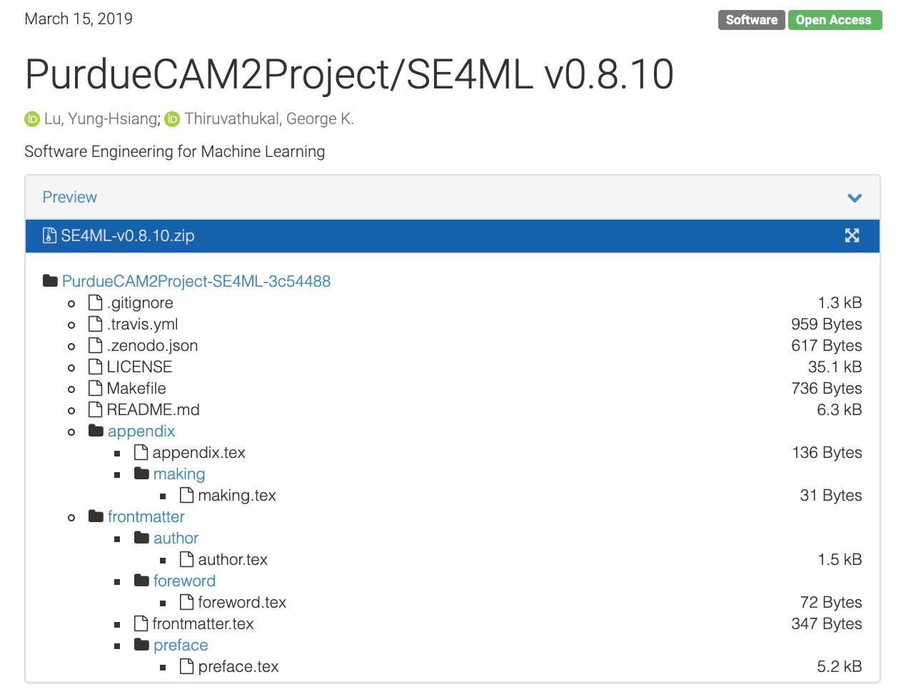

Reproducibility
====================

Reproducibility Packages
----------------------------

Reproducible computation requires more than being open source and providing open data sets.
While open access and liberal licensing are essential prerequisites, on top of this minimum we require structured organization of the materials and detailed documentation of the processes.

A "reproducibility package" [Barba-Praxis]_ includes descriptions about files uploaded to a data repository, including but not limited to code, parameters, input arguments, plotting scripts, and figures corresponding to a particular result. In software engineering, we often use the term "configuraiton management" to manage software artifacts; however, a reproducibility package is focused not only the software artifact but all artifacts in support of reproducibility to ensure that an experiment can be carried out fully by others trying to use the methods.

IEEE Computing in Science and Engineering, a publication focused on scientific and engineering computing, has a Reproducible Research Department [Barba-Thiruvathukal-RR]_, which is the first magazine department in the IEEE Computer Society to have a peer-reviewed track that requires authors to submit reproducibility packages and undergo peer review (which is also done openly). For an article to be accepted, all code and datasets must meet specific requirements and be deposited prior to peer review. The ideas of this chapter build on the work done to form this track.

Containers
-----------

Containers a provide support for a "virtual environment". Containers can be particularly helpful toward building reproducibility packages for machine learning and computer vision research, since the container scripts themselves are assets that can be maintained under version control  and included with the reproducibility package. There is no limit on how many scripts can be created.

Beyond software, in the case of machine learning and computer vision, it is crucial to support data artifacts. 
A key component of reproducibility is to integrate with scholarly archival. Acquiring and obtaining a DOI for the package assures that the materials are  discoverable and citable.
There is a growing trend toward software citation.

IEEE Computing in Science and Engineering's Reproducible Research track and the Journal of Open Source Software. %, which are both pioneering efforts in reproducible research, focused on computational science and research software, respectively.

Zenodo and GitHub Release Archival
------------------------------------

This book itself is an example of a Zenodo artifact.

We use Travis to *release* the book, which in our case means bundling the source code (which is done by default as part of the release process) and the HTML/PDF versions. The HTML version is pushed to GitHub pages upon successful build. The PDF version is pushed to GitHub Releases as part of the post-build (deploy) process, assuming a successful build.

.. literalinclude:: zenodo/code/.travis.yml
   :language: javascript

Zenodo developed a GitHub integration to support permanent archival of a GitHub repository and any build artifacts it may produce.

   Zenodo landing page (release contents)

For this to work, you need to use `git tag` for tagging your releases. We use Semantic Versioning [Semantic-Versioning]_, which essentially means to use `vMAJOR.MINOR[.POINT]]` where MAJOR is a number associated with a new software release; MINOR is typically when you have new features; and POINT is where you did some sort of bug fix or minor change but did not release any new features. All of this is rather subjective. For a major release, we typically use `.0`.

.. figure:: zenodo/figures/zenodo-git-tags.png

   Git tags show up as new Zenodo artifacts

Zenodo metadata for including author info. You're going to want this, because the Zenodo GitHub integration, by default, does not include the author information and derives most of it from GitHub ids, etc. This allows you to recognize all co-authors of your work and to include other useful information, such as the ORCID and other useful keyword metadata.

.. literalinclude:: zenodo/code/.zenodo.json
   :language: javascript

If all goes according to plan, your artifact shows up with proper author information, which allows others to cite your work properly.

.. figure:: zenodo/figures/zenodo-doi-and-citation.png

   Zenodo DOIs and Citation

.. [Barba-Praxis] Praxis of Reproducible Computational Science, https://doi.org/10.22541/au.153922477.77361922

.. [Barba-Thiruvathukal-RR] Reproducible Research for Computing in Science & Engineering, Computing in Science and Engineering, https://ieeexplore.ieee.org/document/8090467

.. [Semantic-Versioning] Semantic Versioning Specification, https://semver.org/
