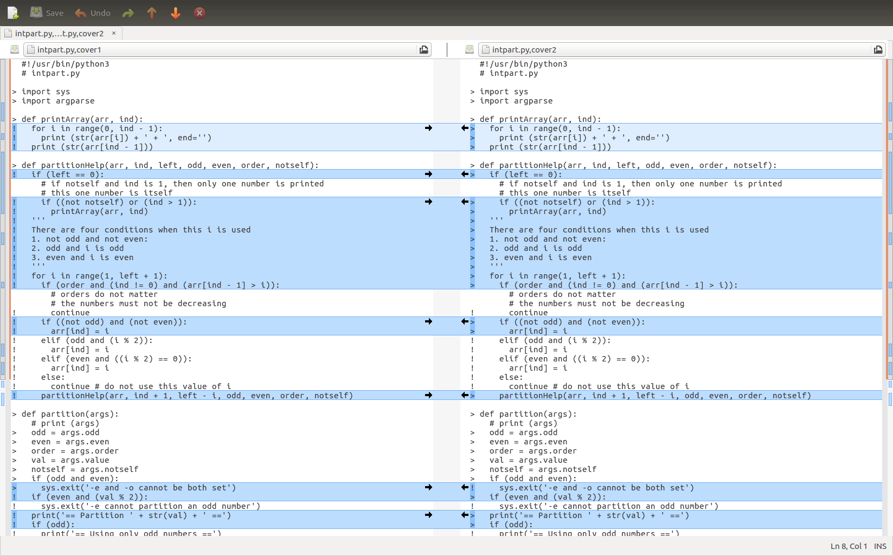

Testing
=======

Testing is an essential part for creating high-quality software.  Many
software developers understand the importance of testing but they do
not really understand how to write tests and they do not understand
the limitations of testing. This chaptper provides deeper insight
about testing.

Structure of Tests
------------------

Many books talk about the importance of testing and how to write tests.
However, few books talk about how to structure tests. Before writing any
test, you need to answer an important question: do you want the testing
code to be sent to the users (or customers)? In most cases, the answer
is no. The program used to generate the product sent to customers is
often called the “production code”. You do not want to include test code
inside production code for many reasons. First, including testing code
may make your product bigger (in terms of storage) and slower (in terms
of execution time). Worse, testing often needs specific inputs and the
expected outputs for these test cases. Will you also give these inputs
and outputs to your customers? If you do not, why do you include testing
code in the product?

Mixing production code and testing code is a common mistake for
beginning software developers. Worse, many of them have a lot of
“debugging messages” as they test code. When the program is ready for
production and release, what will they do with these debugging messages?
In almost all cases, your customers do not understand the debugging
messages and you have to remove the code printing these messages. Here
is the problem. When you remove the code printing these messages, the
risk is too high for one of two things to happen. First, you do not
remove all the code printing the debugging messages. Your customers are
annoyed by the mysterious debugging messages. Your competitors know more
than what you to reveal about your proudct. The second scenario is
worse. You accidentally remove more code than you intend and you
actually add bugs to your program. Your program no longer works and your
customers are very angry at your product.

The correct way of creating tests is to separate testing code from the
production code in different files (probably in different directories).
The production code does what it needs to do as the product. The testing
code tests the production code. When your product is ready, exclude the
testing code, the inputs, and the expected outputs before releasing your
product. Figure \ `[fig:teststructure01] <#fig:teststructure01>`__
illustrates this concept.

.. figure:: test/figures/teststructure01.png

   Production code and test code should be completely separated.

Use Assert Correctly
--------------------

Another common mistake among beginning software developers is to use
assert incorrectly. This is what they often do.

::

     # This is production code
     ....
     assert(condition that should be true)
     ....

This is one example how assert may be used:

::

   def func(x):
       assert (x > 1)

There are three problems when you do this. First, if the condition is
not true, the program immediately stops. There is no second chance.
Imagine that your program is a text editor. When a user wants to save
the content to a file, your program does not want to erase an existing
file. You put assert there claiming that the file must not exist. If a
user accidentially uses a file whose name already exists, the program
stops and everything typed by the user is lost. You will definietely
have a user that will never buy any product from you. Some people argue
that “I put assert there because I know it must be true.” That argument
is self-contraditory. If you know that the condition must be true, you
will not put assert there. Would you write

::

   assert (1 > 0)

You don’t.

If you are abosolutly certain the condition must be true, you do not
need to put assert there.

Some people say, “I will remove all assert before releasing the
product.” This can be done easily using the grep -v command. This,
however, brings the second problem. What would happen if some of the
assert statements actually do something useful? Consider the following
case:

::

   assert (x = y)

This assigns y’s value to x.

What you really want to do is probably to ensure that x and y are the
same:

::

   assert (x == y)

The earlier assert statement assigns y’s value to x. Hence, their
values are same and the intended assert is actually true. If you
remove the assert and no longer assign y’s value to x, the program may
not work any more. Human eyes are not good detecting the differences
between = and ==. This is a difficult bug to fix because keeping
assert means the program is correct. Removing assert means the program
is wrong.  These problems about misuse ``assert`` were observed in the
authors' classes.  They actually happened multiple times.

The third problem is, perhaps, somewhat philosophical. It is the
attitude of creating good software. Software is deployed in many
safety-critical systems. Mistakes in these systems may cause signficant
amounts of financial losses, body injuries, or even deaths. Allowing a
program to sudden stop is simply an unacceptable way of thinking. Using
assert is an irresponsible way of writing production code. It expresses
the attutide “Something is not expected. My program commits suicide and
the rest is not my problem any more.” A more responsbile way of writing
good software is to handle the problem and do not stop the program.

If assert has these problems, does that mean assert should not be used
at all? You should not use assert in production code. You can use assert
in the testing code, as shown in
Figure \ `[fig:teststructure02] <#fig:teststructure02>`__.

.. figure:: test/figures/teststructure02.png

Use ``assert`` in the testing code. Do not put ``assert`` in  production code.

In this example, the testing code uses assert to check whether the
output from function 1 is correct. This is particularly important before
sending it to the input of function 2. This further emphasizes the
importance of separating production code from testing code.

Exception
---------

To be added later

Pytest
------

Python has a tool for testing calle pytest. It automatically looks for
the files starting with test\_ and ending with .py and executes the
functions whose names start with test\_. The following is a simple
example.

.. literalinclude:: ../../programs/software/test/test_example1.py
   :language: python

Running pytest gets the following output:

::

   $ pytest
   ============ test session starts =============
   platform linux -- Python 3.5.2, pytest-4.3.0, py-1.8.0, pluggy-0.9.0
   rootdir: /..., inifile:
   collected 1 item

   test_example1.py .                                

Here, the rootdir is the directory where you run pytest. This output
means the tests have passed.

Change the program as follows: returntrue returns False and returnfalse
returns True:

.. literalinclude:: ../../programs/software/test/test_example2.py
   :language: python

Running pytest gets this result, showing the test has failed.

::

   ======================== FAILURES ========================
   ____________________ test_truefalse ______________________

       def test_truefalse():
   >       assert returntrue() == True
   E       assert False == True
   E        +  where False = returntrue()

   test_example2.py:11: AssertionError
   ==================== 1 failed in 0.04 seconds ====================

When you create tests, it is important that you check whether the tests
may fail. Passing tests is not the purpose of testing. The purpose of
testing is to detect mistakes in production code and correct the code.
If a test can never fail, this test is useless.

Next, considers a slightly more complex program for testing two
functions: f1 and f2:

.. literalinclude:: ../../programs/software/test/test_example3.py
   :language: python

This is the output of pytest:

::

   ======================== FAILURES ========================
   _______________________ test_f1f2 ________________________

       def test_f1f2():
           assert f1(3) == 4
           assert f1(-3) == -2
   >       assert f2(3) == 4
   E       assert 2 == 4
   E        +  where 2 = f2(3)

   test_example3.py:13: AssertionError

The result says that calling f1(3) and f1(-3) have passed the tests.
Calling f2(3) has failed because f2(3) return 2 but the test program
expects 4.

Earlier this chapter said testing code and production code should be
separated. The examples for pytest above violated this rule. The
following examples will follow the rule separating the testing code from
the tested code. Consider a file with two functions: f1 and f2:

.. literalinclude:: ../../programs/software/test/funcs.py
   :language: python

This is the output when calling the functions interactively:

::

   $ python3
   Python 3.5.2 (default, Nov 12 2018, 13:43:14) 
   [GCC 5.4.0 20160609] on linux
   Type "help", "copyright", "credits" or "license" for more information.
   >>> import funcs
   >>> funcs.f1(3)
   4
   >>> funcs.f2(5)
   6
   25
   15

A test program calls funcs.f1(3) and funcs.f2(5).

.. literalinclude:: ../../programs/software/test/test_example4.py
   :language: python

This is the output when calling the functions interactively:

Running pytest, however, has no output. What is happening? Instead of
printing to a computer screen (also called the console), pytest,
captures the output. The reason is that pytest does not want to print
too many things. If too many things are printed to the screen, it is
likely that some important messages are ignored. Another reason is that
pytest often runs automatically when no human is watching (more details
about this later in the section on Continuous Integration). There are
two solutions: The first is to tell pytest to print to the screen by
adding -s after pytest. This defeats the purpose of pytest’s intention
not to print to the screen.

The second is a better and more general solution: it saves the captured
output to a file. It is actually quite straightforward:

.. literalinclude:: ../../programs/software/test/test_example5.py
   :language: python

The function test_f1f2() has an input for capturing the outputs. This
input will be provided automatically by pytest. To get the captured
output, it calls readouterr(). This function returns the captured output
to standard output (also called stdout) and the standard error (also
called stderr). Separating stdout from stderr gives more flexibility:
the former is the normal output and the latter is the error messages. By
default, both stdout and stderr are shown on a computer screen but it is
possible saving them to different files.

The testing program test_example5.py saves the standard output to a file
called capturedstdout. All outputs by the print statements in funcs are
saved in this file. The content of the file is (as expected)

::

   4
   6
   25
   15

When the outputs are saved to a file, testing can be done automatically
without human watching by following these steps:

#. write the expected output to a file

#. capture the output from pytest and save it to another file

#. compare the two files

The following program shows these steps

.. literalinclude:: ../../programs/software/test/test_example6.py
   :language: python

The tests uses filecmp.cmp to compare the context of two files. As
explained, if a test cannot fail, it is useless. If funcs.f2(5) is
replaced by funcs.f2(4), pytest fails. This suggests that pytest is
actually testing funcs.f2.

Test Integer Partition
----------------------

Only “toy” examples for pytest are shown so far. By capturing the
outputs, pytest can compare expected outputs with the actual outputs.
Thus, it becomes much easier testing many cases using a single test
program. The following program tests integer partition using three
different values: 3, 4, and 5. The expected outputs are stored in a
separate directory called expected and the files are called, not
surprisingly, 3, 4, and 5.

.. literalinclude:: ../../programs/software/test/test_intpart1.py
   :language: python

Test Coverage
-------------

Test coverage means how much percentage of code that has been tested.
Getting test coverage is pretty easy: python has a program called
coverage. Simply adding coverage run before the program to be tested
(and the necessary arguments).

::

   $ coverage run intpart.py -e -o 5
   -e and -o cannot be both set
   $ coverage report
   Name         Stmts   Miss  Cover
   --------------------------------
   intpart.py      50     26    48%

The first coverage run command executes the Python program intpart.py
with arguments -e -o 5. Since it is not possible partitioning any
integer using only even numbers and using only odd numbers at the same
time, the intpart.py program stops without partitioning the input value
5. The coverage is 48%.

To see which line has been tested, add annotate after coverage and the
file intpart.py,cover is created, as shown below

::

     #!/usr/bin/python3
     # intpart.py
     
   > import sys
   > import argparse
     
   > def printArray(arr, ind):
   !   for i in range(0, ind - 1):
   !     print (str(arr[i]) + ' + ', end='')
   !   print (str(arr[ind - 1]))
     
   > def partitionHelp(arr, ind, left, odd, even, order, notself):
   !   if (left == 0):
         # if notself and ind is 1, then only one number is printed
         # this one number is itself
   !     if ((not notself) or (ind > 1)):
   !       printArray(arr, ind)
   !   '''
   !   There are four conditions when this i is used
   !   1. not odd and not even: 
   !   2. odd and i is odd
   !   3. even and i is even
   !   '''
   !   for i in range(1, left + 1):
   !     if (order and (ind != 0) and (arr[ind - 1] > i)):
           # orders do not matter
           # the numbers must not be decreasing
   !       continue
   !     if ((not odd) and (not even)):
   !       arr[ind] = i 
   !     elif (odd and (i % 2)):
   !       arr[ind] = i
   !     elif (even and ((i % 2) == 0)):
   !       arr[ind] = i
   !     else:
   !       continue # do not use this value of i
   !     partitionHelp(arr, ind + 1, left - i, odd, even, order, notself)
     
   > def partition(args):
       # print (args)
   >   odd = args.odd
   >   even = args.even
   >   order = args.order
   >   val = args.value
   >   notself = args.notself
   >   if (odd and even):
   >     sys.exit('-e and -o cannot be both set')
   !   if (even and (val % 2)):
   !     sys.exit('-e cannot partition an odd number')
   !   print('== Partition ' + str(val) + ' ==')
   !   if (odd):
   !     print('== Using only odd numbers ==')
   !   if (even):
   !     print('== Using only even numbers ==')
   !   arr = [0] * val
   !   partitionHelp(arr, 0, val, odd, even, order, notself)
     
   > def checkArgs(args = None):
   >   parser = argparse.ArgumentParser(description='parse arguments')
   >   parser.add_argument('-o', '--odd', action='store_true',
   >                       help = 'odd numbers only', default = False)
   >   parser.add_argument('-e', '--even',action='store_true',
   >                       help = 'even numbers only', default = False)
   >   parser.add_argument('-r', '--order',action='store_true',
   >                       help = 'orders do not matter', default = False)
   >   parser.add_argument('-s', '--notself',action='store_true',
   >                       help = 'not to include itself', default = False)
   >   parser.add_argument('value', type = int,
   >                       help = 'number to parition')
   >   pargs = parser.parse_args(args)
   >   return pargs
       
   > if __name__== "__main__":
   >   args = checkArgs(sys.argv[1:])
   >   partition(args)
     

If a line starts with >, this line has been tested. If a line starts
with !, this line has not been tested.

Next, run intpart.py again without -e or -o. This time coverage report
says 80% code is covered and coverage annotate generates the following
file:

::

     #!/usr/bin/python3
     # intpart.py
     
   > import sys
   > import argparse
     
   > def printArray(arr, ind):
   >   for i in range(0, ind - 1):
   >     print (str(arr[i]) + ' + ', end='')
   >   print (str(arr[ind - 1]))
     
   > def partitionHelp(arr, ind, left, odd, even, order, notself):
   >   if (left == 0):
         # if notself and ind is 1, then only one number is printed
         # this one number is itself
   >     if ((not notself) or (ind > 1)):
   >       printArray(arr, ind)
   >   '''
   >   There are four conditions when this i is used
   >   1. not odd and not even: 
   >   2. odd and i is odd
   >   3. even and i is even
   >   '''
   >   for i in range(1, left + 1):
   >     if (order and (ind != 0) and (arr[ind - 1] > i)):
           # orders do not matter
           # the numbers must not be decreasing
   !       continue
   >     if ((not odd) and (not even)):
   >       arr[ind] = i 
   !     elif (odd and (i % 2)):
   !       arr[ind] = i
   !     elif (even and ((i % 2) == 0)):
   !       arr[ind] = i
   !     else:
   !       continue # do not use this value of i
   >     partitionHelp(arr, ind + 1, left - i, odd, even, order, notself)
     
   > def partition(args):
       # print (args)
   >   odd = args.odd
   >   even = args.even
   >   order = args.order
   >   val = args.value
   >   notself = args.notself
   >   if (odd and even):
   !     sys.exit('-e and -o cannot be both set')
   >   if (even and (val % 2)):
   !     sys.exit('-e cannot partition an odd number')
   >   print('== Partition ' + str(val) + ' ==')
   >   if (odd):
   !     print('== Using only odd numbers ==')
   >   if (even):
   !     print('== Using only even numbers ==')
   >   arr = [0] * val
   >   partitionHelp(arr, 0, val, odd, even, order, notself)
     
   > def checkArgs(args = None):
   >   parser = argparse.ArgumentParser(description='parse arguments')
   >   parser.add_argument('-o', '--odd', action='store_true',
   >                       help = 'odd numbers only', default = False)
   >   parser.add_argument('-e', '--even',action='store_true',
   >                       help = 'even numbers only', default = False)
   >   parser.add_argument('-r', '--order',action='store_true',
   >                       help = 'orders do not matter', default = False)
   >   parser.add_argument('-s', '--notself',action='store_true',
   >                       help = 'not to include itself', default = False)
   >   parser.add_argument('value', type = int,
   >                       help = 'number to parition')
   >   pargs = parser.parse_args(args)
   >   return pargs
       
   > if __name__== "__main__":
   >   args = checkArgs(sys.argv[1:])
   >   partition(args)
     

Many lines change from ! (not tested) to > (tested). The second test has
80% coverage, higher than the first test.

Figure \ `[fig:comparecoverage] <#fig:compareconverage>`__.

Compare the two coverage outputs.

Here are the tests that can
achieve 100% coverage:

::

   coverage run intpart.py -o 5
   coverage run intpart.py -e 6
   coverage run intpart.py -o 8
   coverage run intpart.py -r 5
   coverage run intpart.py -s 4
   coverage run intpart.py
   coverage run intpart.py -h

Is a higher coverage always better? This a common misunderstanding. The
purpose of testing is to discover problems. If a test can discover
problems, it is a good test even if it covers only a small percentage of
code. The next common misunderstanding may surprise you: Even if your
tests have 100% coverage, the program may still have undiscoverd
problems. “How can that be possible?” “100% test coverage.”

The misunderstanding occurs from the definition of coverage. Test
coverage is defined by whether each line has been tested; it is not
defined by whether each scenario has been tested. What is the
difference? Consider the following example:

::

   if (condition1):
       # A
   else:
       # B
   ...
   if (condition2):
       # C
   else:
       # D
   ...

The flow can be expressed in
Figure \ `[fig:twoconditions] <#fig:twoconditions>`__.

.. image:: test/figures/twoconditions.png

There are four possible scenarios of the two conditions:

#. condition1: True, condition2: True

#. condition1: True, condition2: False

#. condition1: False, condition2: True

#. condition1: False, condition2: False

If a test has True for condition1 and False for condition2, then A and D
have been tested. Another test has False for condition1 and True for
condition2, then B and C have been tested. These two test cases have
tested A, B, C, and D. In other words, all code has been tested and the
coverage is 100%.

“Wait” “How can it be possible to get 100% coverage even with only two
tests? There are four scenarios.” You may ask.

That is the problem.

What does this mean? Does this mean coverage is not helpful? Test
coverage is very helpful. percentage. You should check whether the
specific lines you want to test have been covered. Do not focus on the
coverage number only.

Continous Integration
---------------------

Have you ever had a situation when your software has a bug but it is
not discovered for a long time?  The existence of the bug and its
ability to escape detection may surprise your entire team. "How did
that happen?", you may ask.  This may happen due to a wide variety of
reasons. One of the possible reasons is that the software has not been
well tested and as a result the bug is not detected. Testing is an
important method detecting bugs.  However, testing can be tideous.  It
is common that someone makes a "small" change and skips testing.
The person believes the change is so small and cannot possibly have
any bug.  If several people add a few small changes here and there,
the software soon is full of "small" bugs.  Why do people not test
their programs immediately after they have made changes?  One reason
is that testing require additional work.

Is it possible testing is fully automated without any additional
effort? *Continuous Integration* (CI) does exactly that.  You
still need to write testers. There is no way avoiding that part.  The
previous sections explain how to write tests.  What continuous
integration does is to automatically invole these testers whenver you
push your program to the shared repository.  This section uses 
``Travis-CI`` for continuous integration. 

.. image:: test/figures/travis01.png

Travis-CI.com is a website supporting continuous integration.

Using Travis-CI is quite simple. You need to add a special file whose
name is ``.travis.yml``.  It tells Travis-CI what to do when changes
are pushed to github.  This is a simple example:

::

   $ python3 --version
   Python 3.5.2

The content of this file should be pretty easy to understand: It says
the repository uses Python as the language and version 3.5 is
required.  When changes are pushed, run ``pytest`` and it
automatically looks for a Python program starting with ``test_`` (such
as ``test_intpart``}.  If it runn successfully, it is green.  If the
test fails, it will appear red.  You are encouraged to modify the
test, make it fail, and see what a failure looks like.

.. image:: test/figures/travis02.png

Running pytest successfully in Travis-CI.	   

Limitations of Testing
----------------------

It is important understanding that testing has limitations. It is
practically impossible testing every possible scenario. Every ``if`` is a
condition. A condition divides a program into two different paths
depending whether the condition is true or not. A non-trivial program
can easily have hundreds of conditions. As a simple explanation why it
is not possible testing every possible scenario. Let’s consider a
program with 100 independent conditions, i.e., whether one condition is true
or false does not affect any other condition. There are :math:`2^{100}`
possible scenarios. The fastest computer in the world can perform
several hundred quadrillion (:math:`10^{15}`) calculations per second;
this is a parallel computer but let’s not worry about that detail.
Because :math:`\log_2(10) \approx 3.3`,
:math:`10^{15} \approx 2 ^ {50}`. Thus, the fastest computer can check
as many as :math:`2 ^ {50}` conditions per second. How many can this
computer check per minute? :math:`2 ^ {50} \times 60`. How about a day
(86,400 seconds)? :math:`2 ^ {50} \times 86400 \approx 2 ^ {66}`. In
order to test :math:`2^{100}` possible scenarios, this computer needs to
work :math:`2^{34}` days; this is very long time (much longer than the
history of humans). In fact, the situation is even worse. The estimation
above considers only two possible cases for each condition: true or
false. If the condition compares two numbers, then “every possible
scenario” means every possible pairs of these two numbers. What does
this mean? It would be completely impossible testing every possible
scenario of a program’s execution paths controlled by the conditions.

Does this mean there is no need to test because it is not possible
testing all possible scenarios? No. What it means is that testing has to
be done carefully so that testing can detect as many problems (i.e.,
bugs) as possible. Good tests should consider many different scenarios.

Halting Problems: Unsolvable Problems
-------------------------------------

Is it possible checking whether a program is correct by using another program?
More specifically, is it possible writing a program, called :math:`p`, that has
three inputs: (1) another  program :math:`q`, (2)  input data :math:`i`,  and
(3) expected output :math:`e` and decides whether program :math:`q`
produces :math:`e` when taking the input :math:`i`, *without* running
the program :math:`q`. This problem is at least as difficult as another problem:

Is it possible writing a program, called :math:`p`, that has two
inputs: (1) another program :math:`q`, (2) input data :math:`i` and
decides whether program :math:`q` will eventually stop or not (i.e.,
entering an infinite loop) when taking the input :math:`i`.  This is
called thd *halting problem* in computation theory.  It turns that the
halting problem cannot be solved.

This is not a formal proof but it gives the intuition why the halting
problem cannot be solved.

First, it is possible to write a program :math:`p` that takes another
program :math:`q` as the input. An operating system is such as program
:math:`p`. A compiler is also such a program :math:`p`.  Second,
:math:`p` cannot simply run :math:`q` with input :math:`i`. The reason
is that if :math:`q` does not stop, :math:`p` runs indefintely without
an answer.  We do not know whether :math:`q` takes very long time and
will eventually stop, or it will never stop.  Third, since :math:`p`
can take a program :math:`q` as the input, :math:`p` can also take
itself as the input.

So far, nothing is surprising. Next, we will explain why such a
program :math:`p` is not possible. The "proof" uses contradition: We
first assume that it is possible creating such a program :math:`p` and
then show that contradition occurs. Thus, the assumption (it is
possible creating such a program :math:`p`) is wrong.

If it is possible creating :math:`p`, then it is possible creating
:math:`\tilde{p}` by changing :math:`p` slightly:

- If :math:`p`'s answer is yes, :math:`\tilde{p}` enters an infinite loop and thus cannot answer the question.

- If :math:`p`'s answer is no, :math:`\tilde{p}` says yes.

Next, rename :math:`\tilde{p}` as :math:`p`.    

Now, there is a problem.  If :math:`p`'s answer is Yes, it enters an
infinite loop and it will not halt.  If :math:`p`'s answer is no, it
says yes.  In other words, :math:`p`'s answer should be exactly the
opposite of its answer.  What does this mean? How can this be
possible?  Why do we get contradiction?

We get contradiction because we have made a wrong assumption: it is
possible creating :math:`p`.  The truth is that it is not possible
creating a program :math:`p` that takes a program :math:`q` and an
input :math:`i` and decides whether :math:`q` halts when giving the
input :math:`i`.

What does this mean to testing?  Deciding whether a program halts is
no more difficult deciding whether the program produces a correct
output.  If it impossible to solve the halting problem, it is
impossible writing a program :math:`p` that decides whether program
:math:`q` given input :math:`i` produces expected output :math:`e`.

Another unsolvable problem is determining whether two programs (that
are not identical) have the same outputs when given the same inputs.
Precisely, It is not possible creating a program :math:`p` that takes
two inputs: (1) a program :math:`q` and (2) the third program
:math:`r` and answers whether :math:`q` and :math:`r` have the same
output for every possible input.
