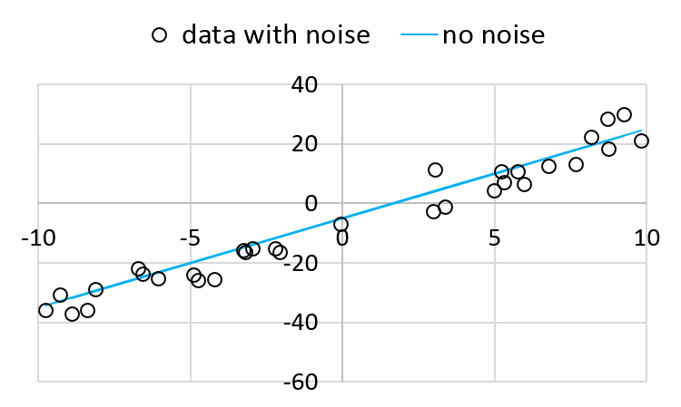
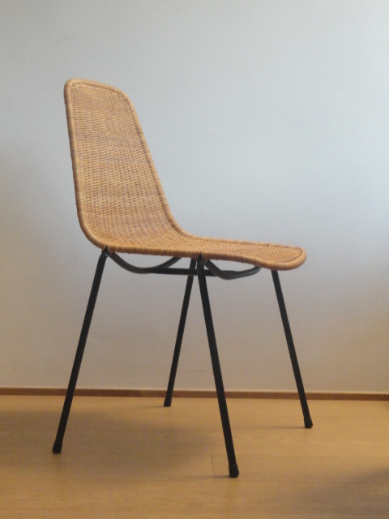
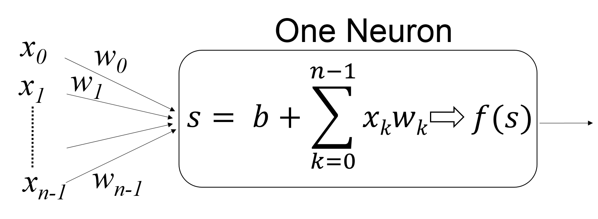
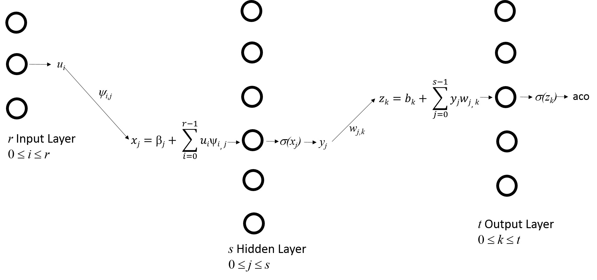

Gradient Descent
================

Learning Objectives

- Understand partial derivative and gradient

- Understand how gradient descent may be used in optimization problems

- Apply gradient descent in machine learning

Linear Approximation with Least Square Error
--------------------------------------------

As mentioned in the previous section, supervised machinear learning
can be formulated as a minimization problem: minimizing the
error. This chapter starts with a problem that is probably farmiliar
to many people already: *linear approximation with least square
error*.

Consider a list of :math:`n` points: :math:`(x_1, \tilde{y_1})`,
:math:`(x_2, \tilde{y_2})`, ..., :math:`(x_n, \tilde{y_n})`.  Please
notice the convention: :math:`y = a x + b` is the underlying equation
and :math:`y` is the "correct" value. It is generally not possible
getting the correct value of :math:`y` due to noise and limitation of
meausrement instruments. Instead, we can get only the observed
:math:`y` with noise.  To distinguish these two, we use
:math:`\tilde{y}` to express the observed value. It may be different
from the true value of :math:`y`.

The problem is to find the values of :math:`a` and :math:`b` for a
line :math:`y = a x + b` such that

:math:`e(a, b)= \underset{i=1}{\overset{n}{\sum}} (y_i - (a x_i +   b))^2`

is as small as possible. This is the cumulative error. Let's call it
:math:`e(a, b)` because it has two variables :math:`a` and :math:`b`.
Here we will solve this problem in two ways: analytically and
numerically.

Analytics Method for Least Square Error
^^^^^^^^^^^^^^^^^^^^^^^^^^^^^^^^^^^^^^^

In Calculus, you have learned the concept of derivative. Suppose
:math:`f(x)` is a function of a single variable :math:`x`. The
derivative of :math:`f(x)` with respect to :math:`x` is defined as

:math:`f'(x) = \frac{d}{dx} f(x) = \underset{h \rightarrow 0}{\text{lim}} \frac{f(x + h) - f(x)}{h}`

The derivative calculates the ratio of change in :math:`f(x)` and the
change in :math:`x`. A geometric interpretation is the slope of
:math:`f(x)` at a specific point of :math:`x`.

Extend that concept to a multivariable function. Suppose :math:`f(x,
y)` is a function of two variables :math:`x` and :math:`y`. The
partial derivative of :math:`f(x,y)` with respect to :math:`x` at
point :math:`(x_0, y_0)` is defined as

:math:`\frac{\partial f}{\partial x}| _{(x_0, y_0)} = \frac{d}{dx} f(x, y_0) | _{x = x_0} =\underset{h \rightarrow 0}{\text{lim}} \frac{f(x_0 + h, y_0) - f(x_0, y_0)}{h}`

The derivative calculates the ratio of change in :math:`f(x, y)` and the
change in :math:`x` *while keeping the value of* :math:`y` *unchanged*. 

Similarly, the partial derivative of :math:`f(x,y)` with respect to
:math:`y` at point :math:`(x_0, y_0)` is defined as

:math:`\frac{\partial f}{\partial y}| _{(x_0, y_0)} = \frac{d}{dy} f(x_0, y) | _{y = y_0} =\underset{h \rightarrow 0}{\text{lim}} \frac{f(x_0, y_0 + h) - f(x_0, y_0)}{h}`

To minimize the error function, we take the partial derivatives of
:math:`a` and :math:`b` respectively:

:math:`\frac{\partial e}{\partial a}  = 2 (a  x_1 + b - y_1)  x_1 + 2 (a  x_2 + b - y_2)  x_2 + ... + 2 (a  x_n + b - y_n)  x_n`

:math:`\frac{\partial e}{\partial a}  = 2 a (x_1^2 + x_2^2 + ... + x_n^2) + 2 b (x_1 + x_2 + ... + x_n) - 2 (x_1 y_1 + x_2 y_2 + ... + x_n y_n)`

:math:`\frac{\partial e}{\partial a}  = 2 (a \underset{i=1}{\overset{n}{\sum}} x_i^2 + b \underset{i=1}{\overset{n}{\sum}} x_i - \underset{i=1}{\overset{n}{\sum}} x_i y_i)`

For :math:`b`:   

:math:`\frac{\partial e}{\partial b} = 2 (a  x_1 + b - y_1) + 2 (a  x_2 + b - y_2) + ... + 2 (a \times x_n + b - y_n)`

:math:`\frac{\partial e}{\partial b} = 2 a (x_1 + x_2 + ... + x_n) + 2 n b  - 2 (y_1 + y_2 + ... + y_n)`

:math:`\frac{\partial e}{\partial b} = 2 (a \underset{i=1}{\overset{n}{\sum}} x_i + b n - \underset{i=1}{\overset{n}{\sum}} y_i)`          

      
To find the minimum, set both to zero and obtain two linear equations of :math:`a` and :math:`b`.
      
:math:`a \underset{i=1}{\overset{n}{\sum}} x_i^2 + b \underset{i=1}{\overset{n}{\sum}} x_i = \underset{i=1}{\overset{n}{\sum}} x_i y_i`       

:math:`a \underset{i=1}{\overset{n}{\sum}} x_i + b n = \underset{i=1}{\overset{n}{\sum}} y_i`       

The values of :math:`a` and :math:`b` can be expressed by

:math:`a =\frac{n \underset{i=1}{\overset{n}{\sum}} x_i y_i - \underset{i=1}{\overset{n}{\sum}} x_i \underset{i=1}{\overset{n}{\sum}} y_i}{n \underset{i=1}{\overset{n}{\sum}} x_i^2 - \underset{i=1}{\overset{n}{\sum}} x_i \underset{i=1}{\overset{n}{\sum}} x_i}`

:math:`b =\frac{\underset{i=1}{\overset{n}{\sum}} y_i \underset{i=1}{\overset{n}{\sum}} x_i^2 - \underset{i=1}{\overset{n}{\sum}} x_i y_i \underset{i=1}{\overset{n}{\sum}} x_i}{n \underset{i=1}{\overset{n}{\sum}} x_i^2 - \underset{i=1}{\overset{n}{\sum}} x_i \underset{i=1}{\overset{n}{\sum}} x_i}`

Let's consider an example:

+--------------------+----------------------+
| x                  | y                    |
+====================+======================+
| 8.095698376        | 23.51683637          |
+--------------------+----------------------+
| 6.358470914        | 9.792790054          |
+--------------------+----------------------+
| -9.053869996       | -39.96474572         |
+--------------------+----------------------+
| -8.718226575       | -30.35310844         |
+--------------------+----------------------+
| 8.92002599         | 26.16662601          |
+--------------------+----------------------+
| -9.304226583       | -37.4223126          |
+--------------------+----------------------+
| -4.413344816       | -18.03547019         |
+--------------------+----------------------+
| 9.24473846         | 24.39367474          |
+--------------------+----------------------+
| 2.717746556        | -4.589498946         |
+--------------------+----------------------+
| 5.87537092         | 15.7037148           |
+--------------------+----------------------+
| -2.962047549       | -7.508042385         |
+--------------------+----------------------+
| -1.793005634       | -11.81506333         |
+--------------------+----------------------+
| -2.341379964       | -14.96321124         |
+--------------------+----------------------+
| 4.742625547        | 2.282082477          |
+--------------------+----------------------+
| -2.007598497       | -5.068305913         |
+--------------------+----------------------+
| 9.333353675        | 28.44940642          |
+--------------------+----------------------+
| 2.570708237        | 3.086379154          |
+--------------------+----------------------+
| -4.846225403       | -25.6409577          |
+--------------------+----------------------+
| 2.571789981        | 7.795844519          |
+--------------------+----------------------+
| -9.044770879       | -26.25061389         |
+--------------------+----------------------+
| 5.09385439         | 8.166196092          |
+--------------------+----------------------+
| -5.665252693       | -21.99241714         |
+--------------------+----------------------+
| 1.193065754        | 0.698347441          |
+--------------------+----------------------+
| -8.739601542       | -31.96384225         |
+--------------------+----------------------+
| -5.850434065       | -17.51926158         |
+--------------------+----------------------+
| 4.556308579        | 9.854628779          |
+--------------------+----------------------+
| -0.509866694       | -10.85684654         |
+--------------------+----------------------+
| -0.24261641        | -8.33876201          |
+--------------------+----------------------+
| 7.930407455        | 19.56805947          |
+--------------------+----------------------+
| 6.201498841        | 5.836888055          |
+--------------------+----------------------+
| -3.524341584       | -19.45328039         |
+--------------------+----------------------+
| 6.034477356        | 19.15245129          |
+--------------------+----------------------+

The pairs are plotted below:

.. figure:: gradient/figures/xy1.png

The value of :math:`y` is calculated by

:math:`y = 3 x - 5 + \epsilon`

here :math:`\epsilon` is the error (or noise) and it is set to a randeom number between -8 and 8.

The figure shows the line without noise:

Using the equations, :math:`a = 3.11806` and :math:`b = -5.18776`.

Next, we explain how to solve the problem using *gradient descent*.
      
Gradient
--------

The *gradient* of a two-variable function :math:`f(x, y)` is at point :math:`(x_0, y_0)` is defined as

:math:`\nabla f|_{(x_0, y_0)} = \frac{\partial f}{\partial x} {\bf i} + \frac{\partial f}{\partial y} {\bf j}`

Here, :math:`{\bf i}` and :math:`{\bf j}` are the unit vector in the :math:`x` and :math:`y` directions.

Suppose :math:`{\bf v} = \alpha {\bf i} + \beta {\bf j}` is a unit
vector. Then, the amount of :math:`f`'s changes in the direction of
:math:`{\bf v}` is the inner product of :math:`\nabla f` and
:math:`{\bf v}`.  The greatest change occurs at the direction when
:math:`{\bf v}` is the unit vector of :math:`\nabla f`.  Since
:math:`{\bf v}` is a unit vector, if its direction is different from
:math:`\nabla f`, the inner product must be smaller.

One way to understand graident is to think about speed bumps on roads.

.. figure:: gradient/figures/roadbump.png

The bump is modeled as a half cylinder. For simplicity, we assume that
the bump is infinitely long in the :math:`x` direction. A point on the
surface of the bump can be expressed as

:math:`p = x {\bf i} + \alpha \cos(\theta) {\bf j} + \beta \sin(\theta) {\bf k}`

The gradient is

:math:`\nabla p = \frac{\partial p}{\partial x} {\bf i} + \frac{\partial p}{\partial y} {\bf j} + \frac{\partial p}{\partial z} {\bf k} = {\bf i} + \alpha (- \sin(\theta)) {\bf j} + \beta \cos(\theta) {\bf k}.`

This is the *tangent* of the point on the surface.

Next, consider another vector (such as the tire of your unicycle) goes
through this bump.  We consider a unicycle because it is simpler: we
need to consider only one wheel. What is the rate of changes along
this surface? If you ride the unicycle along this bump without getting
onto the bump, then the vector of your movement can be expressed by

:math:`v = x {\bf i}`

How is this affected by the slope of the bump? The calculation is the *inner product* of the two vectors:

:math:`\nabla p \cdot v = x {\bf i}`.

Notice that this inner product contains no :math:`\theta`. What does
this mean? It means that your movement is not affected by
:math:`\theta`. This is obvious because you are not riding onto the
bump.

Next, consider that you ride straight to the bump. The vector will be

:math:`v = - y {\bf j}`

The slope of the bump affects your actual movement, again by the inner product:

:math:`\nabla p \cdot v = y \alpha \sin(\theta) {\bf j}`.

How can we interpret this? The moment when your tire hits the bump,
:math:`\theta` is zero so your tire's movement along the :math:`{\bf
j}` direction is zero. This is understandable because you cannot
penetrate into the bump.  When the tire is at the top of the bump,
:math:`\theta` is :math:`\frac{\pi}{2}` and the tire has the highest
speed.

Based on this understanding, it is easier to answer the following
question: "Which direction along the surface gives the greatest
changes?"  Because the actual change is the inner product of the
direction and the gradient, the greatest change occurs along the
direction of the gradient.

Gradient Descent
----------------

*Gradient Descent* is a method for solving *minimization* problems.
The gradient of a function at a point is the rate of changes at that
point.  Let's consider a simple example: use gradient descent to find
a line that has the smallest sum of square error. This is the same
problem described above. The earlier solution uses formulae to find
:math:`a` and :math:`b`. Here, we will not use the formulae.

The gradient of a function is the direction of changes. 

:math:`\nabla e = \frac{\partial e}{\partial a} {\bf i} + \frac{\partial e}{\partial b} {\bf j}`

Suppose :math:`\Delta w = \alpha {\bf i} + \beta {\bf j}` is a vector.   
    
By definition, if :math:`\Delta w` is small enough, then the change in
:math:`\nabla e` alogn the direction of :math:`\Delta w` can be
calculated as

:math:`\Delta e = \nabla e \cdot \Delta w`.

The goal is to reduce the error. Thus, :math:`\Delta w` should be chosen to ensure that :math:`\Delta e` is negative.
If we make

:math:`\Delta w = - \eta \nabla e`,

then

:math:`\Delta e = \nabla e \cdot (- \eta \nabla e) = - \eta (\nabla e)^2`.

This ensures that the error :math:`e` becomes smaller.  The value
:math:`\eta` is called the *learning rate*.  Its value is usually
between 0.1 and 0.5.  If :math:`\eta` is too small, :math:`\Delta e`
changes very slowly, i.e., learning is slow.  If :math:`\eta` is too
large, :math:`\Delta e = \nabla e \cdot \Delta w` is not necessarily
true.

Numerical Method for Least Square Error
^^^^^^^^^^^^^^^^^^^^^^^^^^^^^^^^^^^^^^^

It is possible to find an analytical solution for :math:`a` and
:math:`b` because the function :math:`e` is pretty simple.  For many
machine learning problems, the functions are highly complex and in
many cases the functions are not even known in advance. For these
problems, reducing the errors can be done numerically using data.
This section is further divided into two different scenarios.

- The first assumes that we know the function :math:`e` but we do not have formulaes for :math:`a` or :math:`b`.

- The second assumes that we do not know the function :math:`e` and certainly do not know the formulaes for :math:`a` or :math:`b`.  This is the common scenario. 

For the first case, 

:math:`\nabla e = \frac{\partial e}{\partial a} {\bf i} + \frac{\partial e}{\partial b} {\bf j}`

            
:math:`\frac{\partial e}{\partial a} = 2 (a \underset{i=1}{\overset{n}{\sum}} x_i^2 + b \underset{i=1}{\overset{n}{\sum}} x_i - \underset{i=1}{\overset{n}{\sum}} x_i y_i)`

      
:math:`\frac{\partial e}{\partial b} = 2 (a \underset{i=1}{\overset{n}{\sum}} x_i + b n - \underset{i=1}{\overset{n}{\sum}} y_i)`

This is ``gradient1`` below.

For the second case, the gradient can be estimated using the definition of partial derivative. This is shown in
``gradient2`` below.

After finding the gradient using either method, the values of
:math:`a` and :math:`b` change by :math:`- \eta \nabla e`.

.. literalinclude:: gradient/code/gradientdescent.py
   :language: python

The two methods get similar results: The first method gets 3.153 and
-5.187 for :math:`a` and :math:`b` respectively.  The second method
gets 3.027 and -5.192.

Numerical Method for Least Square Error of Quadratic Function
^^^^^^^^^^^^^^^^^^^^^^^^^^^^^^^^^^^^^^^^^^^^^^^^^^^^^^^^^^^^^

The examples above uses a linear function :math:`y = a x + b`. Now,
let's consider a more complex example: a quadratic function:
:math:`y = a x^2  + b x + c`. The error function is defined
by three terms: :math:`a`, :math:`b`, and :math:`c`.

:math:`e(a, b, c)= \underset{i=1}{\overset{n}{\sum}} (y_i - (a x_i ^ 2 +  b x_i + c))^2`

The value of :math:`y` is calculated by

:math:`y = 3 x^2 - 5 x + 4 + \epsilon`

here :math:`\epsilon` is the error (or noise) and it is set to a randeom number between -8 and 8.

+--------------------+----------------------+
| x                  | y                    |
+====================+======================+
| -3.370103805       | 60.79185325          |
+--------------------+----------------------+
| 0.417414305	     | -5.323619187         |
+--------------------+----------------------+
| -6.159102555	     | 154.3634865          |
+--------------------+----------------------+
| -4.407403766	     | 82.5948879           |
+--------------------+----------------------+
| 9.217171131	     | 211.5745285          |
+--------------------+----------------------+
| -7.174813026	     | 188.278774           |
+--------------------+----------------------+
| 6.361795959	     | 88.5112383           |
+--------------------+----------------------+
| 1.79223335	     | 11.99774387          |
+--------------------+----------------------+
| -1.926842791	     | 26.55005374          |
+--------------------+----------------------+
| 3.11961916	     | 12.0001045           |
+--------------------+----------------------+
| 3.407105822        | 25.23458989          |
+--------------------+----------------------+
| 3.516276644        | 27.86258459          |
+--------------------+----------------------+
| -6.446048868       | 153.4091251          |
+--------------------+----------------------+
| -1.611122918       | 16.29112594          |
+--------------------+----------------------+
| -9.423197392       | 320.9271831          |
+--------------------+----------------------+
| -0.163191843       | 1.413342642          |
+--------------------+----------------------+
| -7.984372477       | 237.3069972          |
+--------------------+----------------------+
| -1.083286108       | 20.77621844          |
+--------------------+----------------------+
| -1.721374317       | 28.35361787          |
+--------------------+----------------------+
| 9.307151676        | 211.0397578          |
+--------------------+----------------------+
| 2.847589125        | 15.49036578          |
+--------------------+----------------------+
| -9.704318719       | 333.9723539          |
+--------------------+----------------------+
| 6.652947501        | 106.6501811          |
+--------------------+----------------------+
| 1.286261333        | -2.972412887         |
+--------------------+----------------------+
| 6.730248976        | 104.7116952          |
+--------------------+----------------------+
| 4.198544935        | 29.78821666          |
+--------------------+----------------------+
| 8.730545018        | 183.571542           |
+--------------------+----------------------+
| -5.944582098       | 142.8709084          |
+--------------------+----------------------+
| 3.596351215        | 19.40151             |
+--------------------+----------------------+
| -5.606758376       | 132.9978749          |
+--------------------+----------------------+
| -7.680210557       | 215.0928846          |
+--------------------+----------------------+
| 1.852911853        | 2.423800574          |
+--------------------+----------------------+

The pairs are plotted below:

.. figure:: gradient/figures/quadratic.png

The program for calculating :math:`a`, :math:`b`, and :math:`c`
needs only slight changes from the previous program:
	    
.. literalinclude:: gradient/code/gradientdescent2.py
   :language: python

Running this program ten times gets the following results:

+--------------------+----------------------+----------------------+
| a                  | b                    | c                    |
+====================+======================+======================+
| 3.011255896382324  | -5.237109053403006   | 4.587766159787751    |
+--------------------+----------------------+----------------------+
| 2.9118463569721067 | -5.235739889402345   | 4.558316574435434    |
+--------------------+----------------------+----------------------+
| 2.913418168901663  | -5.236030395939285   | 4.611313910795599    |
+--------------------+----------------------+----------------------+
| 3.01028934524673 9 | -5.237423283136554   | 4.6514776776523155   |
+--------------------+----------------------+----------------------+
| 3.0116767376997156 | -5.2370171800113     | 4.568807336762989    |
+--------------------+----------------------+----------------------+
| 3.0116145023680554 | -5.237035419533481   | 4.572520167800626    |
+--------------------+----------------------+----------------------+
| 2.911538900320818  | -5.2359055455148615  | 4.591420135857997    |
+--------------------+----------------------+----------------------+
| 2.908676740232057  | -5.2363349865534214  | 4.682182248171528    |
+--------------------+----------------------+----------------------+
| 2.911471635130624  | -5.235840824838787   | 4.5789355660578455   |
+--------------------+----------------------+----------------------+
| 2.911385934228692  | -5.235874673892769   | 4.585754511975301    |
+--------------------+----------------------+----------------------+

The calculated values are pretty consistent.

Gradient Descent for Neural Networks
------------------------------------

Three-Layer Neural Networks
^^^^^^^^^^^^^^^^^^^^^^^^^^^

Neural networks are the foundation of the recent impressive progress
in machine learning. The problems described so far have pretty clear
mathematical foundations (for example, linear approximation or
quadratic approximation). More complex problems can be difficult to
express mathematically. Let's consider an example in our everyday
life: How do you describe a "chair"? "Simple", you may say. You define
"A chair has four legs with a flat surface on which a person can sit,
like this figure":

If that is a chair, how about this one?  "Well, that is also a
chair.", you may say. 

You change your answer to "A chair has two or four legs with a flat
surface on which a person can sit."  There are still problems: How about
the following two? Are they chairs?

.. figure:: gradient/figures/chair4.jpg

As you can see, it is not so easy to define a chair.
   
The same problem occurs in many other cases. How do you define a car?
You may say, "A car is a vehicle with four wheels and can transport
people."  Some cars have only three wheels. Some cars have six
wheels. Some cars do not transport people.

Instead of giving a definition, another approach is to give many
examples and a complex enough function so that the function can learn
the common characteristics of these examples.  Neural networks are
complex *non-linear* functions and they have the capabilities of
learning from many examples.  More details about neural networks will
be covered in later chapters. This chapter gives only a few simple
examples showing how gradient descent can be used to learn.

Neural networks use one particular architecture for computing.  This
architecture is inspired by animal brains where billions of neurons
are connected.  This book does not intend to explain how neural
networks resemble brains, nor the biological experiments discovering the
mechanisms of brain functions.  Instead, this section solve relatively
simple problems (creating logic gates) using this particular
architecture.

The following figure is an example of a neural network with three
layers: an input layer, an output layer, and a hidden layer. A layer
is hidden simply because it is neither the input layer nor the output
layer.

.. figure:: gradient/figures/layers.png

   Neural network of three layers

In this example, the input layer has two neurons (neurons 0-1), the
hidden layer has four neurons (neurons 0-3), and the output layer has
two neurons (neurons 0-1).  Prior studies show that a neural network
with only two layers (input and output) without any hidden layer has
limited capability. Thus, almost all neural networks have hidden
layers.  Some complex networks can have dozens or even hundreds of
hidden layers.  It has been shown that *deep* neural networks can be
effective learning complex tasks. Here, deep means neural networks
have many hidden layers.  Information moves from the layers on the
left toward the layers on the right.  There is no feedback of
information.  Nor do two neurons of the same layer exchange
information.  Different layers may have different numbers of neurons.

.. figure:: gradient/figures/forward.png

   Connects neurons of different layers.  These are the only connections between enurons.  Please notice that the numbers of neurons are 2, 4, and 2 in the three layers.

The neurons in two adjacent layers are connected by weights, are
expressed as a three-dimensional array:

:math:`weights[l][s][d]`

connects the neuron at layer :math:`l` to layer :math:`l + 1`;
:math:`s` is the source and :math:`d` is the destination. It is also
written as :math:`w_{l, s, d}`.  Please notice that the indexes start
from zero.

.. figure:: gradient/figures/weights.png   

	    Definition of the indexes for weights

	    
In the example, the left weight :math:`weights[0][1][2]` has the first
index 0 because it connects the input layer (layer 0) with the hidden
layer (layer 1). From the top, this is the second neuron of the input
layer; thus, the second index is 1.  The destination is the third
neuron in the hidden layer and the index is 2.  The right weight is
:math:`weights[1][3][0]`. The first index is 1 because it is from the
hidden layer (layer 1). The second index is 3 because the source is
the fourth neuron from the top. The destination is the first neuron in
the output layer; thus, the third index is 0.

Each neuron performs relatively simple calculation, as shown below.

	    Computation performed by one neuron

A neuron in the input layer has only one input (only :math:`x_i`) and
the weight is always 1. A neuron in the hidden or the output layer has
multiple inputs.  Each neuron performs three stages of
computation. First, the products of the input and the weight are
added.

:math:`\underset{k = 0}{\overset{n-1}{\Sigma}} x_k w_k`.

Next, a constant called *bias* is added

:math:`b + \underset{k = 0}{\overset{n-1}{\Sigma}} x_k w_k`.

The value is then passed to an *activation function* :math:`f`.  This
must be a non-linear function because linear functions are too limited
in their ability to handle complex situations.

.. note::

   The world is not linear. Imagine that you really love chocolate. If
   you eat one piece of chocolate, you feel pretty good. If you eat
   two pieces of chocolate, you feel even better. Does this mean you
   feel better and better after you eat more and more chocolate?
   No. After you eat a lof of chocolate, you may feel that's enough
   and want to stop. The same situation applies to everything. Imagine
   you get paid $20 an hour. If you work for two hours, you get
   $40. Can you make more and more money if you work longer and
   longer? No. First, each day has only 24 hours. You can make at most
   $480 per day if you do not sleep.  If you do not sleep, you will
   fall ill soon and have to stop working.

Several activation
functions are popular. This section uses the *sigmoid* function,
expressed as :math:`\sigma(x)`, is one of the most widely used:

:math:`\sigma(x) = \frac{1}{1 + e^{-x}}`.

Because :math:`e^{-x} > 0`, :math:`\sigma(x)` is always between 0
and 1.

      
The :math:`\sigma` function has a special property: the derivative of
:math:`\sigma(x)` can be calculated easily:

.. math::
  :nowrap:
     
  \begin{eqnarray}
  & \frac{d \sigma(x)}{d x} \\
  & =  \frac{d}{dx} (\frac{1}{1 + e^{-x}}) \\
  & = - \frac{1}{(1 + e^{-x})^2} \frac{d}{dx} (1 + e^{-x}) \\
  & =  \frac{e^{-x}}{(1 + e^{-x})^2} \\
  & = \frac{1}{1 + e^{-x}} \frac{e^{-x}}{1 + e^{-x}} \\
  & = \frac{1}{1 + e^{-x}} \frac{1 + e^{-x} - 1}{1 + e^{-x}} \\
  & = \sigma(x) (1 - \sigma(x)).
  \end{eqnarray}  

What does this mean? It means that we can calculate :math:`\frac{d
\sigma(x)}{d x}` if we know :math:`\sigma(x)` *without* knowing the
value of :math:`x`.  If the value of :math:`\sigma(x)` is :math:`v`
for a particular value of :math:`x`, then the derivative of
is :math:`v (1-v)`.
      

Consider the following neuron. It has two inputs with values 0.99 and
0.01 respectively.  The weights are 0.8 and 0.2. The bias is 0.3.

.. figure:: gradient/figures/neuralnet1.png   

	    Example to calculate a neuron's output

The value of :math:`s` is 0.3 + 0.99 :math:`\times` 0.8 + 0.01 :math:`\times` 0.2 = 1.094.
After the *sigmoid* function, this neuron's output is

:math:`\frac{1}{1+ e^{-1.094}} = 0.7491342`.

Next, consider a complete neural network with all weights and biases:      
      
.. figure:: gradient/figures/neuralnet2.png   

	    Example to calculate a neural network's outputs

The following table shows how to calculate the outputs of the
four neurons in the hidden layer:

+--------+--------+--------+------+-------+--------------------+
| neuron | input  | weight | bias | sum   | output             |
+========+========+========+======+=======+====================+
| 0      | 0.99   |  0.7   | 0.1  | 0.798 | 0.689546499265968  | 
|        +--------+--------+      |       |                    |      
|        | 0.01	  |  0.5   |      |       |                    |
+--------+--------+--------+------+-------+--------------------+
| 1      | 0.99   |  0.8   | 0.3  | 1.094 | 0.749134199078648  | 
|        +--------+--------+      |       |                    |      
|        | 0.01	  |  0.2   |      |       |                    |
+--------+--------+--------+------+-------+--------------------+
| 2      | 0.99   |  0.8   | 0.5  | 1.2955| 0.785076666300568  | 
|        +--------+--------+      |       |                    |      
|        | 0.01	  |  0.35  |      |       |                    |
+--------+--------+--------+------+-------+--------------------+
| 3      | 0.99   |  0.6   | 0.4  | 0.9965| 0.730369880613158  | 
|        +--------+--------+      |       |                    |      
|        | 0.01	  |  0.25  |      |       |                    |
+--------+--------+--------+------+-------+--------------------+

How are these numbers calculated. This is the procedure for
the first neuron:

:math:`s = 0.1 + 0.99 \times 0.7 + 0.01 \times 0.5 = 0.798`

:math:`\frac{1}{1 + e^{-0.798}} = 0.689546499265968`

The next table shows how the outputs are calculated.

+--------+--------------------+--------+------+-----------------+--------------------+
| neuron | input              | weight | bias | sum             | output             |
+========+====================+========+======+=================+====================+
| 0      | 0.689546499265968  |  0.33  | 0.27 | 1.5473332709399 | 0.824528239528756  |
|        +--------------------+--------+      |                 |                    |      
|        | 0.7491341990786481 |  0.16  |      |                 |                    |
|        +--------------------+--------+      |                 |                    |
|        | 0.785076666300568  |  0.31  |      |                 |                    |
|        +--------------------+--------+      |                 |                    |
|        | 0.730369880613158  |  0.94  |      |                 |                    |
+--------+--------------------+--------+------+-----------------+--------------------+
| 1      | 0.689546499265968  |  0.28  | 0.45 | 1.75723688345954| 0.852863261520065  |
|        +--------------------+--------+      |                 |                    |      
|        | 0.7491341990786481 |  0.76  |      |                 |                    |
|        +--------------------+--------+      |                 |                    |
|        | 0.785076666300568  |  0.48  |      |                 |                    |
|        +--------------------+--------+      |                 |                    |
|        | 0.730369880613158  |  0.23  |      |                 |                    |
+--------+--------------------+--------+------+-----------------+--------------------+

The outputs of the two neurons are 0.824528239528756 and 0.852863261520065.

Gradient Descent in Neural Networks (Backpropagation)
^^^^^^^^^^^^^^^^^^^^^^^^^^^^^^^^^^^^^^^^^^^^^^^^^^^^^

How can the concept of gradient descent be used to make neural
networks produce the desired outputs? The answer is to adjust the
weights and the biases. More precisely, the adjustment starts from the
outputs toward the inputs and it is called *back propagation*.  For
the three layer networks shown above, the changes start from
:math:`weight[1]` based on the differences of the desired and the
actual outputs. After adjusting :math:`weight[1]`, the method adjusts
:math:`weight[0]` between the hidden layer and the input layer.

When the actual outputs are different from the expected outputs, the
difference is called the *error*, usually expressed as :math:`E`.
Consider the following definition of error:

:math:`E = \underset{k=0}{\overset{t-1}{\sum}} \frac{1}{2} (exv_k - aco_k)^2`,

Here :math:`exv_k` is the expect value and :math:`aco_k` is the actual
output of the :math:`k^{th}` neuron (among :math:`t` neurons).  This
definition adds the squares of errors from all output neurons. Do not
worry about the constant :math:`\frac{1}{2}` because it is for
convenience here.  It will be cancelled later.

*Gradient descent* can also be used to reduce the errors.  The process
is more complex than the previous examples because neural networks are
more complex: We can change the weights but their effects go through
the non-linear activiation function.  It is not easy expressing the
relationships between the error and the weights.  In other words, the
effects of weights go through a composition of functions (additions
first and then the non-linear function).

Chain Rule
""""""""""

Before explaining how to adjust the weights, let's review function
composition.  Consider that :math:`f(x)` and :math:`g(x)` are
functions.  We can create a *composition of these two functions*. For
example, suppose :math:`f(x) = 3 x + 8` and :math:`g(x) = (x + 1) ^
2`. The composition of :math:`f(x)` and :math:`g(x)` can be written
as:

:math:`(f \circ g)(x) = f(g(x)) = f((x+1)^2) = 3 (x + 1) ^ 2 + 8 = 3 x^2 + 6 x + 11`.

In this case, :math:`g(x)` is applied first and then :math:`f(x)`.

It is also possible to switch the order of the composition, written differently:

:math:`(g \circ f)(x) = g(f(x)) = g(3x + 8) = ((3x + 8) + 1) ^ 2 = 9 x^2 + 54 x + 81`.

In this case, :math:`f(x)` is applied first and then :math:`g(x)`.

What happens if we want to calculate the effect of changes in
:math:`x` to the composite function :math:`(f \circ g)(x)`? We need to
apply the *chain rule*.  

:math:`(f \circ g)'(x) = f'(g(x)) \cdot g'(x)`.

Let's validate this by using the example:

:math:`(f \circ g)(x) = 3 x ^ 2 + 6 x + 11`.

Thus, :math:`(f \circ g)'(x) = 6 x + 6`.

Next, we calculate :math:`f'(x) = 3` and :math:`g'(x) = 2 x + 2`.

:math:`(f \circ g)'(x) = f'(g(x)) \cdot g'(x) = 3 (2 x + 2) = 6x + 6`.

Error and Weights between Output and Hidden Layers
""""""""""""""""""""""""""""""""""""""""""""""""""

	    Definitions of the symbols

      
Symbols and their meanings:

+-------------------+-----------------------------------------------------------------+
| symbol            | meaning                                                         |
+===================+=================================================================+
| :math:`r`         | number of neurons in the input layer                            |
+-------------------+-----------------------------------------------------------------+
| :math:`s`         | number of neurons in the hidden layer                           |
+-------------------+-----------------------------------------------------------------+
| :math:`t`         | number of neurons in the output layer                           |
+-------------------+-----------------------------------------------------------------+
| :math:`i`         | index of a neuron in the input layer :math:`0 \le i < r`        |
+-------------------+-----------------------------------------------------------------+
| :math:`j`         | index of a neuron in the hidden layer :math:`0 \le j < s`       |
+-------------------+-----------------------------------------------------------------+
| :math:`k`         | index of a neuron in the output layer :math:`0 \le k < t`       |
+-------------------+-----------------------------------------------------------------+
| :math:`\beta_j`   | bias of the :math:`j^{th}` neuron in the hidden layer           |
+-------------------+-----------------------------------------------------------------+
| :math:`b_k`       | bias of the :math:`k^{th}` neuron in the output layer           |
+-------------------+-----------------------------------------------------------------+
| :math:`u_i`       | input to the :math:`i^{th}` neuron in the input layer           |
+-------------------+-----------------------------------------------------------------+
| :math:`x_j`       | input to the :math:`j^{th}` neuron in the hidden layer          |
+-------------------+-----------------------------------------------------------------+
| :math:`y_j`       | output of the :math:`j^{th}` neuron in the hidden layer         |
+-------------------+-----------------------------------------------------------------+
| :math:`z_k`       | input to the :math:`k^{th}` neuron in the output layer          |
+-------------------+-----------------------------------------------------------------+
| :math:`aco_k`     | output of the :math:`k^{th}` neuron in the output layer         |
+-------------------+-----------------------------------------------------------------+
| :math:`exv_k`     | expected value of the :math:`k^{th}` neuron in the output layer |
+-------------------+-----------------------------------------------------------------+
|:math:`\psi_{i,j}` | weight connecting the :math:`i^{th}` and :math:`j^{th}` neurons |
+-------------------+-----------------------------------------------------------------+
|:math:`w_{j, k}`   | weight connecting the :math:`j^{th}` and :math:`k^{th}` neurons |
+-------------------+-----------------------------------------------------------------+
| :math:`\eta`      | learning rate                                                   |
+-------------------+-----------------------------------------------------------------+

Here are the equations expressing the relationships among these terms:

Error: 
:math:`E = \underset{k=0}{\overset{t-1}{\sum}} \frac{1}{2} (aco_k - exv_k)^2`,

Actual output of the :math:`k^{th}` neuron:       
:math:`aco_k = \sigma(z_k)`

Input to the :math:`k^{th}` neuron:       
:math:`z_k = b_k + \underset{j=0}{\overset{s-1}{\sum}} y_j w_{j,k}`

Output of the :math:`j^{th}` neuron:             
:math:`y_j = \sigma(x_j)`

Input to the :math:`j^{th}` neuron:       
:math:`x_j = \beta_j + \underset{i=0}{\overset{r-1}{\sum}} u_i \psi_{i,j}`      

Now, we can apply the chain rule to calculate the relationship between
the error and a weight or a bias.  Consider the output of a particular
neuron.  The expected value is a constant and its derivative is
zero. Thus, we can ignore :math:`\frac{\partial exv_k}{\partial
w_{j,k}}`. Instead, we need to worry about only the relationship
between the actual output :math:`aco_k` and a weight :math:`w_{j,k}`.

:math:`\frac{\partial E}{\partial w_{j,k}} = \frac{\partial E}{\partial aco_k} \frac{\partial aco_k}{\partial w_{j,k}}`

:math:`\frac{\partial E}{\partial aco_k} = (aco_k - exv_k)`, because
:math:`aco_k` does not depend on any other neuron in the output layer.

As you can see, the constant :math:`\frac{1}{2}` has been cancelled.

Applying the chain rule again:

:math:`\frac{\partial aco_k}{\partial w_{j,k}} = \frac{\partial aco_k}{\partial z_k} \frac{\partial z_k}{\partial w_{j,k}}`.

As explained earlier,
:math:`\frac{\partial aco_k}{\partial z_k} = \sigma(z_k)(1 - \sigma(z_k)) = aco _k(1 - aco_k)`.

:math:`\frac{\partial z_k}{\partial w_{j,k}} = y_j`.

Now, we can put everything together:

:math:`\frac{\partial E}{\partial w_{j,k}} = (aco_k - exv_k) aco_k (1 - aco_k) y_j`.

Using gradient descent, we want to change the weight

:math:`\Delta w_{j,k} = - \eta \frac{\partial E}{\partial w_{j,k}} = - \eta (aco_k - exv_k) aco_k (1 - aco_k) y_j`.

Similarly,

:math:`\frac{\partial E}{\partial b_k} = (aco_k - exv_k) aco_k (1 - aco_k)`.

To change the bias:

:math:`\Delta b_k = - \eta \frac{\partial E}{\partial b_k} = - \eta (aco_k - exv_k) aco_k (1 - aco_k)`.

Error and Weights between Hidden and Input Layers
"""""""""""""""""""""""""""""""""""""""""""""""""

Next, we adjust the weights between the input and the hidden layer.
The problem of the hidden layer is that we do not have expected values
for the neurons. Instead, we must rely on the expected values at the
output layer.  This is called *back propagation*: propagating the
expected values from the output layer to the hidden layer in order to
adjust the weights.  Consider the weight :math:`\psi_{i,j}` between
the :math:`i^{th}` neuron of the input layer and the :math:`j^{th}`
neuron in the hidden layer.  This weight may affect every neuron in
the output layer.

Continue from the previous derivation, the output of the neuron
:math:`y_j` depends on the values of the input layer, the weights
between the input layer and the hidden layer, and the bias.  To avoid
confusion, here :math:`\psi`, instead of :math:`w`, is used to
express the weight between the input and the hidden layer.

How does the weight :math:`\psi_{i,j}` affects the error? We can apply
the chain rule again:

:math:`\frac{\partial E}{\partial \psi_{i,j}} = \frac{\partial
}{\partial \psi_{i,j}} \underset{k=0}{\overset{t-1}{\sum}} \frac{1}{2}
(aco_k - exv_k)^2 = \underset{k=0}{\overset{t-1}{\sum}} (aco_k -
exv_k) \frac{\partial aco_k}{\partial \psi_{i,j}}`
      
Our next step is to calculate :math:`\frac{\partial aco_k}{\partial \psi_{i,j}}`

We can apply the chair rule again:

:math:`\frac{\partial aco_k}{\partial \psi_{i,j}} = \frac{\partial
aco_k}{\partial z_k} \frac{\partial z_k}{\partial \psi_{i,j}} = aco_k
(1 - aco_k) \frac{\partial z_k}{\partial \psi_{i,j}}`

:math:`\frac{\partial z_k}{\partial \psi_{i,j}} = \frac{\partial      z_k}{\partial y_j} \frac{\partial y_j}{\partial \psi_{i,j}} =      w_{j, k} \frac{\partial y_j}{\partial \psi_{i,j}}`

Apply the chain rule and we can get

:math:`\frac{\partial y_j}{\partial \psi_{i,j}} = \frac{\partial y_j}{\partial x_j} \frac{\partial x_j}{\partial \psi_{i,j}} = y_j (1 - y_j) \frac{\partial x_j}{\partial \psi_{i,j}}`

Finally,
:math:`\frac{\partial x_j}{\partial \psi_{i,j}} = u_i`.

Put everything together:

:math:`\frac{\partial E}{\partial \psi_{i,j}} = \underset{k=0}{\overset{t-1}{\sum}} (aco_k - exv_k)  aco_k (1 - aco_k)  w_{j, k} y_j (1 - y_j) u_i`

Using gradient descent, we want to change the weight
   

:math:`\Delta \psi_{i,j} = -\eta \underset{k=0}{\overset{t-1}{\sum}} (aco_k - exv_k)  aco_k (1 - aco_k)  w_{j, k} y_j (1 - y_j) u_i`

Similarly,

:math:`\Delta \beta_j = -\eta \underset{k=0}{\overset{t-1}{\sum}} (aco_k - exv_k)  aco_k (1 - aco_k)  w_{j, k} y_j (1 - y_j)`.

      

Neural Networks as Logic Gates
^^^^^^^^^^^^^^^^^^^^^^^^^^^^^^

After understanding the operations of neural networks, it is time to use neural networks
doing something useful. This example considers building a two-input logic gate.
Each gate receives either false (also represented by 0) or true (also represented by 1).
Commonly used gates are shown in the table below:

+---------+---------+-----+----+-----+
| input 0 | input 1 | AND | OR | XOR |
+=========+=========+=====+====+=====+
|    0    |    0    |  0  | 0  |   0 |
+---------+---------+-----+----+-----+
|    0    |    1    |  0  | 1  |   1 |
+---------+---------+-----+----+-----+
|    1    |    0    |  0  | 1  |   1 |
+---------+---------+-----+----+-----+
|    1    |    1    |  1  | 1  |   0 |
+---------+---------+-----+----+-----+

Prior studies have shown that it would not be possible make an XOR gate without
any hidden layer. We won't talk about that here. Instead, right now we focus on how to use graident descent to create logic gates.

