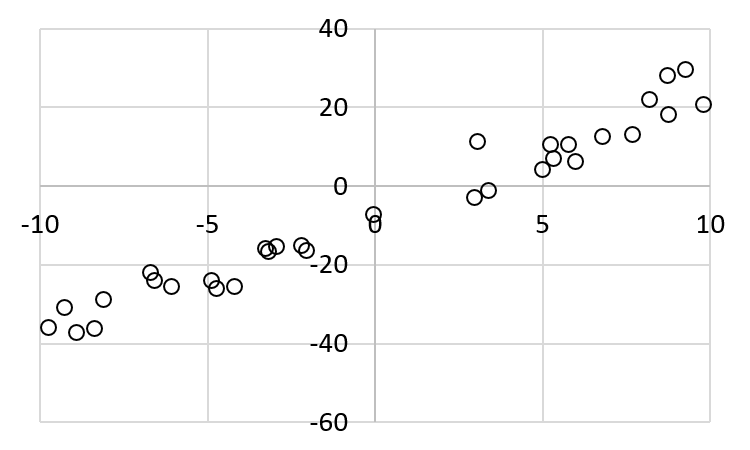
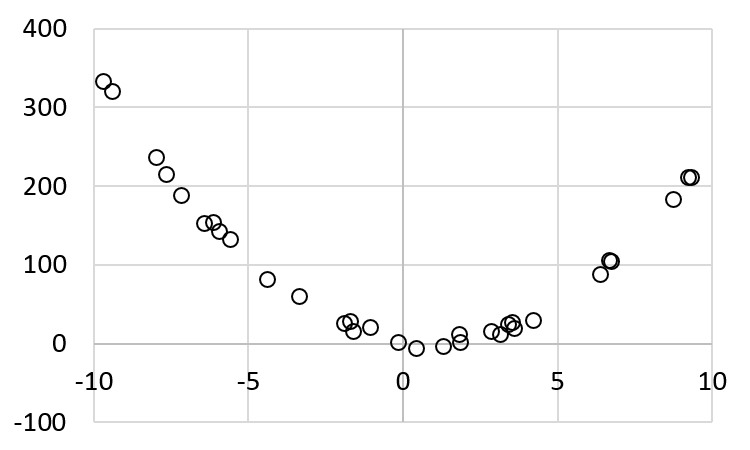

Gradient Descent
================

Learning Objectives

- Understand partial derivative and gradient

- Understand how gradient descent may be used in optimization problems

- Apply gradient descent in machine learning

Linear Approximation with Least Square Error
--------------------------------------------

As mentioned in the previous section, supervised machinear learning
can be formulated as a minimization problem: minimizing the
error. This chapter starts with a problem that is probably farmiliar
to many people already: *linear approximation with least square
error*.

Consider a list of :math:`n` points: :math:`(x_1, \tilde{y_1})`,
:math:`(x_2, \tilde{y_2})`, ..., :math:`(x_n, \tilde{y_n})`.  Please
notice the convention: :math:`y = a x + b` is the underlying equation
and :math:`y` is the "correct" value. It is generally not possible
getting the correct value of :math:`y` due to noise and limitation of
meausrement instruments. Instead, we can get only the observed
:math:`y` with noise.  To distinguish these two, we use
:math:`\tilde{y}` to express the observed value. It may be different
from the true value of :math:`y`.

The problem is to find the values of :math:`a` and :math:`b` for a
line :math:`y = a x + b` such that

:math:`e(a, b)= \underset{i=1}{\overset{n}{\sum}} (y_i - (a x_i +   b))^2`

is as small as possible. This is the cumulative error. Let's call it
:math:`e(a, b)` because it has two variables :math:`a` and :math:`b`.
Here we will solve this problem in two ways: analytically and
numerically.

Analytics Method for Least Square Error
^^^^^^^^^^^^^^^^^^^^^^^^^^^^^^^^^^^^^^^

In Calculus, you have learned the concept of derivative. Suppose
:math:`f(x)` is a function of a single variable :math:`x`. The
derivative of :math:`f(x)` with respect to :math:`x` is defined as

:math:`f'(x) = \frac{d}{dx} f(x) = \underset{h \rightarrow 0}{\text{lim}} \frac{f(x + h) - f(x)}{h}`

The derivative calculates the ratio of change in :math:`f(x)` and the
change in :math:`x`. A geometric interpretation is the slope of
:math:`f(x)` at a specific point of :math:`x`.

Extend that concept to a multivariable function. Suppose :math:`f(x,
y)` is a function of two variables :math:`x` and :math:`y`. The
partial derivative of :math:`f(x,y)` with respect to :math:`x` at
point :math:`(x_0, y_0)` is defined as

:math:`\frac{\partial f}{\partial x}| _{(x_0, y_0)} = \frac{d}{dx} f(x, y_0) | _{x = x_0} =\underset{h \rightarrow 0}{\text{lim}} \frac{f(x_0 + h, y_0) - f(x_0, y_0)}{h}`

The derivative calculates the ratio of change in :math:`f(x, y)` and the
change in :math:`x` *while keeping the value of* :math:`y` *unchanged*. 

Similarly, the partial derivative of :math:`f(x,y)` with respect to
:math:`y` at point :math:`(x_0, y_0)` is defined as

:math:`\frac{\partial f}{\partial y}| _{(x_0, y_0)} = \frac{d}{dy} f(x_0, y) | _{y = y_0} =\underset{h \rightarrow 0}{\text{lim}} \frac{f(x_0, y_0 + h) - f(x_0, y_0)}{h}`

To minimize the error function, we take the partial derivatives of
:math:`a` and :math:`b` respectively:

:math:`\frac{\partial e}{\partial a}  = 2 (a  x_1 + b - y_1)  x_1 + 2 (a  x_2 + b - y_2)  x_2 + ... + 2 (a  x_n + b - y_n)  x_n`

:math:`\frac{\partial e}{\partial a}  = 2 a (x_1^2 + x_2^2 + ... + x_n^2) + 2 b (x_1 + x_2 + ... + x_n) - 2 (x_1 y_1 + x_2 y_2 + ... + x_n y_n)`

:math:`\frac{\partial e}{\partial a}  = 2 (a \underset{i=1}{\overset{n}{\sum}} x_i^2 + b \underset{i=1}{\overset{n}{\sum}} x_i - \underset{i=1}{\overset{n}{\sum}} x_i y_i)`

For :math:`b`:   

:math:`\frac{\partial e}{\partial b} = 2 (a  x_1 + b - y_1) + 2 (a  x_2 + b - y_2) + ... + 2 (a \times x_n + b - y_n)`

:math:`\frac{\partial e}{\partial b} = 2 a (x_1 + x_2 + ... + x_n) + 2 n b  - 2 (y_1 + y_2 + ... + y_n)`

:math:`\frac{\partial e}{\partial b} = 2 (a \underset{i=1}{\overset{n}{\sum}} x_i + b n - \underset{i=1}{\overset{n}{\sum}} y_i)`          

      
To find the minimum, set both to zero and obtain two linear equations of :math:`a` and :math:`b`.
      
:math:`a \underset{i=1}{\overset{n}{\sum}} x_i^2 + b \underset{i=1}{\overset{n}{\sum}} x_i = \underset{i=1}{\overset{n}{\sum}} x_i y_i`       

:math:`a \underset{i=1}{\overset{n}{\sum}} x_i + b n = \underset{i=1}{\overset{n}{\sum}} y_i`       

The values of :math:`a` and :math:`b` can be expressed by

:math:`a =\frac{n \underset{i=1}{\overset{n}{\sum}} x_i y_i - \underset{i=1}{\overset{n}{\sum}} x_i \underset{i=1}{\overset{n}{\sum}} y_i}{n \underset{i=1}{\overset{n}{\sum}} x_i^2 - \underset{i=1}{\overset{n}{\sum}} x_i \underset{i=1}{\overset{n}{\sum}} x_i}`

:math:`b =\frac{\underset{i=1}{\overset{n}{\sum}} y_i \underset{i=1}{\overset{n}{\sum}} x_i^2 - \underset{i=1}{\overset{n}{\sum}} x_i y_i \underset{i=1}{\overset{n}{\sum}} x_i}{n \underset{i=1}{\overset{n}{\sum}} x_i^2 - \underset{i=1}{\overset{n}{\sum}} x_i \underset{i=1}{\overset{n}{\sum}} x_i}`

Let's consider an example:

+--------------------+----------------------+
| x                  | y                    |
+====================+======================+
| 8.095698376        | 23.51683637          |
+--------------------+----------------------+
| 6.358470914        | 9.792790054          |
+--------------------+----------------------+
| -9.053869996       | -39.96474572         |
+--------------------+----------------------+
| -8.718226575       | -30.35310844         |
+--------------------+----------------------+
| 8.92002599         | 26.16662601          |
+--------------------+----------------------+
| -9.304226583       | -37.4223126          |
+--------------------+----------------------+
| -4.413344816       | -18.03547019         |
+--------------------+----------------------+
| 9.24473846         | 24.39367474          |
+--------------------+----------------------+
| 2.717746556        | -4.589498946         |
+--------------------+----------------------+
| 5.87537092         | 15.7037148           |
+--------------------+----------------------+
| -2.962047549       | -7.508042385         |
+--------------------+----------------------+
| -1.793005634       | -11.81506333         |
+--------------------+----------------------+
| -2.341379964       | -14.96321124         |
+--------------------+----------------------+
| 4.742625547        | 2.282082477          |
+--------------------+----------------------+
| -2.007598497       | -5.068305913         |
+--------------------+----------------------+
| 9.333353675        | 28.44940642          |
+--------------------+----------------------+
| 2.570708237        | 3.086379154          |
+--------------------+----------------------+
| -4.846225403       | -25.6409577          |
+--------------------+----------------------+
| 2.571789981        | 7.795844519          |
+--------------------+----------------------+
| -9.044770879       | -26.25061389         |
+--------------------+----------------------+
| 5.09385439         | 8.166196092          |
+--------------------+----------------------+
| -5.665252693       | -21.99241714         |
+--------------------+----------------------+
| 1.193065754        | 0.698347441          |
+--------------------+----------------------+
| -8.739601542       | -31.96384225         |
+--------------------+----------------------+
| -5.850434065       | -17.51926158         |
+--------------------+----------------------+
| 4.556308579        | 9.854628779          |
+--------------------+----------------------+
| -0.509866694       | -10.85684654         |
+--------------------+----------------------+
| -0.24261641        | -8.33876201          |
+--------------------+----------------------+
| 7.930407455        | 19.56805947          |
+--------------------+----------------------+
| 6.201498841        | 5.836888055          |
+--------------------+----------------------+
| -3.524341584       | -19.45328039         |
+--------------------+----------------------+
| 6.034477356        | 19.15245129          |
+--------------------+----------------------+

The pairs are plotted below:

The value of :math:`y` is calculated by

:math:`y = 3 x - 5 + \epsilon`

here :math:`\epsilon` is the error (or noise) and it is set to a randeom number between -8 and 8.

The figure shows the line without noise:

.. figure:: gradient/figures/xy2.png

Using the equations, :math:`a = 3.11806` and :math:`b = -5.18776`.

Next, we explain how to solve the problem using *gradient descent*.
      
Gradient
--------

The *gradient* of a two-variable function :math:`f(x, y)` is at point :math:`(x_0, y_0)` is defined as

:math:`\nabla f|_{(x_0, y_0)} = \frac{\partial f}{\partial x} {\bf i} + \frac{\partial f}{\partial y} {\bf j}`

Here, :math:`{\bf i}` and :math:`{\bf j}` are the unit vector in the :math:`x` and :math:`y` directions.

Suppose :math:`{\bf v} = \alpha {\bf i} + \beta {\bf j}` is a unit
vector. Then, the amount of :math:`f`'s changes in the direction of
:math:`{\bf v}` is the inner product of :math:`\nabla f` and
:math:`{\bf v}`.  The greatest change occurs at the direction when
:math:`{\bf v}` is the unit vector of :math:`\nabla f`.  Since
:math:`{\bf v}` is a unit vector, if its direction is different from
:math:`\nabla f`, the inner product must be smaller.

One way to understand graident is to think about speed bumps on roads.

.. figure:: gradient/figures/roadbump.png

The bump is modeled as a half cylinder. For simplicity, we assume that
the bump is infinitely long in the :math:`x` direction. A point on the
surface of the bump can be expressed as

:math:`p = x {\bf i} + \alpha \cos(\theta) {\bf j} + \beta \sin(\theta) {\bf k}`

The gradient is

:math:`\nabla p = \frac{\partial p}{\partial x} {\bf i} + \frac{\partial p}{\partial y} {\bf j} + \frac{\partial p}{\partial z} {\bf k} = {\bf i} + \alpha (- \sin(\theta)) {\bf j} + \beta \cos(\theta) {\bf k}.`

This is the *tangent* of the point on the surface.

Next, consider another vector (such as the tire of your unicycle) goes
through this bump.  We consider a unicycle because it is simpler: we
need to consider only one wheel. What is the rate of changes along
this surface? If you ride the unicycle along this bump without getting
onto the bump, then the vector of your movement can be expressed by

:math:`v = x {\bf i}`

How is this affected by the slope of the bump? The calculation is the *inner product* of the two vectors:

:math:`\nabla p \cdot v = x {\bf i}`.

Notice that this inner product contains no :math:`\theta`. What does
this mean? It means that your movement is not affected by
:math:`\theta`. This is obvious because you are not riding onto the
bump.

Next, consider that you ride straight to the bump. The vector will be

:math:`v = - y {\bf j}`

The slope of the bump affects your actual movement, again by the inner product:

:math:`\nabla p \cdot v = y \alpha \sin(\theta) {\bf j}`.

How can we interpret this? The moment when your tire hits the bump,
:math:`\theta` is zero so your tire's movement along the :math:`{\bf
j}` direction is zero. This is understandable because you cannot
penetrate into the bump.  When the tire is at the top of the bump,
:math:`\theta` is :math:`\frac{\pi}{2}` and the tire has the highest
speed.

Based on this understanding, it is easier to answer the following
question: "Which direction along the surface gives the greatest
changes?"  Because the actual change is the inner product of the
direction and the gradient, the greatest change occurs along the
direction of the gradient.

Gradient Descent
----------------

*Gradient Descent* is a method for solving *minimization* problems.
The gradient of a function at a point is the rate of changes at that
point.  Let's consider a simple example: use gradient descent to find
a line that has the smallest sum of square error. This is the same
problem described above. The earlier solution uses formulae to find
:math:`a` and :math:`b`. Here, we will not use the formulae.

The gradient of a function is the direction of changes. 

:math:`\nabla e = \frac{\partial e}{\partial a} {\bf i} + \frac{\partial e}{\partial b} {\bf j}`

Suppose :math:`\Delta w = \alpha {\bf i} + \beta {\bf j}` is a vector.   
    
By definition, if :math:`\Delta w` is small enough, then the change in
:math:`\nabla e` alogn the direction of :math:`\Delta w` can be
calculated as

:math:`\Delta e = \nabla e \cdot \Delta w`.

The goal is to reduce the error. Thus, :math:`\Delta w` should be chosen to ensure that :math:`\Delta e` is negative.
If we make

:math:`\Delta w = - \eta \nabla e`,

then

:math:`\Delta e = \nabla e \cdot (- \eta \nabla e) = - \eta (\nabla e)^2`.

This ensures that the error :math:`e` becomes smaller.  The value
:math:`\eta` is called the *learning rate*.  Its value is usually
between 0.1 and 0.5.  If :math:`\eta` is too small, :math:`\Delta e`
changes very slowly, i.e., learning is slow.  If :math:`\eta` is too
large, :math:`\Delta e = \nabla e \cdot \Delta w` is not necessarily
true.

Numerical Method for Least Square Error
^^^^^^^^^^^^^^^^^^^^^^^^^^^^^^^^^^^^^^^

It is possible to find an analytical solution for :math:`a` and
:math:`b` because the function :math:`e` is pretty simple.  For many
machine learning problems, the functions are highly complex and in
many cases the functions are not even known in advance. For these
problems, reducing the errors can be done numerically using data.
This section is further divided into two different scenarios.

- The first assumes that we know the function :math:`e` but we do not have formulaes for :math:`a` or :math:`b`.

- The second assumes that we do not know the function :math:`e` and certainly do not know the formulaes for :math:`a` or :math:`b`.  This is the common scenario. 

For the first case, 

:math:`\nabla e = \frac{\partial e}{\partial a} {\bf i} + \frac{\partial e}{\partial b} {\bf j}`

            
:math:`\frac{\partial e}{\partial a} = 2 (a \underset{i=1}{\overset{n}{\sum}} x_i^2 + b \underset{i=1}{\overset{n}{\sum}} x_i - \underset{i=1}{\overset{n}{\sum}} x_i y_i)`

      
:math:`\frac{\partial e}{\partial b} = 2 (a \underset{i=1}{\overset{n}{\sum}} x_i + b n - \underset{i=1}{\overset{n}{\sum}} y_i)`

This is ``gradient1`` below.

For the second case, the gradient can be estimated using the definition of partial derivative. This is shown in
``gradient2`` below.

After finding the gradient using either method, the values of
:math:`a` and :math:`b` change by :math:`- \eta \nabla e`.

.. literalinclude:: gradient/code/gradientdescent.py
   :language: python

The two methods get similar results: The first method gets 3.153 and
-5.187 for :math:`a` and :math:`b` respectively.  The second method
gets 3.027 and -5.192.

Numerical Method for Least Square Error of Quadratic Function
^^^^^^^^^^^^^^^^^^^^^^^^^^^^^^^^^^^^^^^^^^^^^^^^^^^^^^^^^^^^^

The examples above uses a linear function :math:`y = a x + b`. Now,
let's consider a more complex example: a quadratic function:
:math:`y = a x^2  + b x + c`. The error function is defined
by three terms: :math:`a`, :math:`b`, and :math:`c`.

:math:`e(a, b, c)= \underset{i=1}{\overset{n}{\sum}} (y_i - (a x_i ^ 2 +  b x_i + c))^2`

The value of :math:`y` is calculated by

:math:`y = 3 x^2 - 5 x + 4 + \epsilon`

here :math:`\epsilon` is the error (or noise) and it is set to a randeom number between -8 and 8.

+--------------------+----------------------+
| x                  | y                    |
+====================+======================+
| -3.370103805       | 60.79185325          |
+--------------------+----------------------+
| 0.417414305	     | -5.323619187         |
+--------------------+----------------------+
| -6.159102555	     | 154.3634865          |
+--------------------+----------------------+
| -4.407403766	     | 82.5948879           |
+--------------------+----------------------+
| 9.217171131	     | 211.5745285          |
+--------------------+----------------------+
| -7.174813026	     | 188.278774           |
+--------------------+----------------------+
| 6.361795959	     | 88.5112383           |
+--------------------+----------------------+
| 1.79223335	     | 11.99774387          |
+--------------------+----------------------+
| -1.926842791	     | 26.55005374          |
+--------------------+----------------------+
| 3.11961916	     | 12.0001045           |
+--------------------+----------------------+
| 3.407105822        | 25.23458989          |
+--------------------+----------------------+
| 3.516276644        | 27.86258459          |
+--------------------+----------------------+
| -6.446048868       | 153.4091251          |
+--------------------+----------------------+
| -1.611122918       | 16.29112594          |
+--------------------+----------------------+
| -9.423197392       | 320.9271831          |
+--------------------+----------------------+
| -0.163191843       | 1.413342642          |
+--------------------+----------------------+
| -7.984372477       | 237.3069972          |
+--------------------+----------------------+
| -1.083286108       | 20.77621844          |
+--------------------+----------------------+
| -1.721374317       | 28.35361787          |
+--------------------+----------------------+
| 9.307151676        | 211.0397578          |
+--------------------+----------------------+
| 2.847589125        | 15.49036578          |
+--------------------+----------------------+
| -9.704318719       | 333.9723539          |
+--------------------+----------------------+
| 6.652947501        | 106.6501811          |
+--------------------+----------------------+
| 1.286261333        | -2.972412887         |
+--------------------+----------------------+
| 6.730248976        | 104.7116952          |
+--------------------+----------------------+
| 4.198544935        | 29.78821666          |
+--------------------+----------------------+
| 8.730545018        | 183.571542           |
+--------------------+----------------------+
| -5.944582098       | 142.8709084          |
+--------------------+----------------------+
| 3.596351215        | 19.40151             |
+--------------------+----------------------+
| -5.606758376       | 132.9978749          |
+--------------------+----------------------+
| -7.680210557       | 215.0928846          |
+--------------------+----------------------+
| 1.852911853        | 2.423800574          |
+--------------------+----------------------+

The pairs are plotted below:

