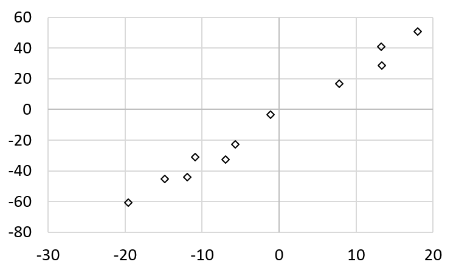
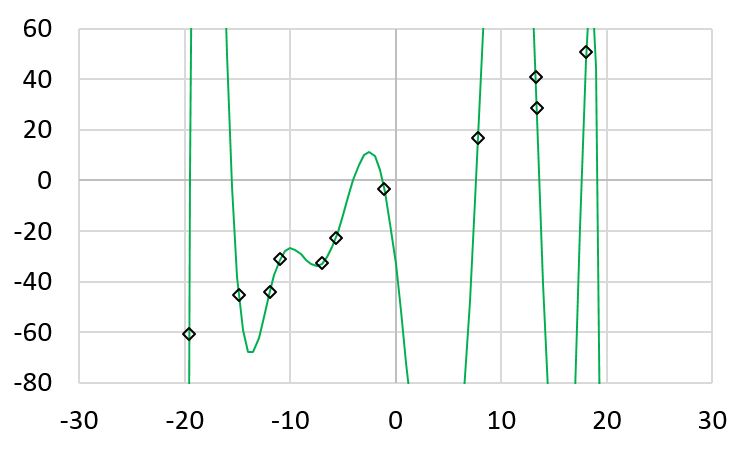

Supervised Machine Learning
============================

Learning Objectives

- Understand supervised learning and the distinction from unsupervised learning
  
- Understand how supervised learning may be used
  
- Distinguish classification and regression problems

Distinguish Supervised and Unsupervised Learning
------------------------------------------------

Another type of learning is called *supervised learning*.
Unsupervised learning means discovering patterns from data, just data.
Supervised learning means associating data with *labels*. When a
father holds a baby saying "Daddy", this is supervised learning: The
baby learns to associate the father's face (data) with the sound of
"Daddy" (label). When a user identifies an email as spam and clicks
the "spam" button in a mail reader, this is supervised learning: The
mail reader learns to associate the email: the data, may include the
subject or the content or the sender, or all of them with the spam
label.

Supervised learning can be further divided into two types of problems:
*classification* and *regression*.  For classification problems, the
labels are discrete values. They can be words, numbers, a finite set
of options, etc.  The labels are discrete because it makes no sense to
have a label "between" two labels.  For example, the input is the
voice of a person and the output is the gender, either female or male.

Minimization Problem
--------------------

Supervised learning is essentially a "minimization problem".  Suppose
there is a collection of :math:`n` images and each image can be
represented by a word. Consider the following examples from the ``COCO
dataset``.

.. figure:: supervised/figures/coco000000006040.jpg

   Tram

.. figure:: supervised/figures/coco000000007108.jpg

   Elephant

.. figure:: supervised/figures/coco000000042070.jpg

   Bus

.. figure:: supervised/figures/coco000000124975.jpg

	    Zebra

The :math:`n` images are the sequence of inputs :math:`{\bf x} = <x_1, x_2,
..., x_n>`.  Each element :math:`x_i` :math:`(1 \le i \le n)` can be
a high-dimensional vector, such as an image. If an image has :math:`w
\times h` pixels, then :math:`x_i` is a vector of :math:`w \times h`
dimensions, each pixel represents one dimension.  For :math:`x_i`, there is
a correct word :math:`y_i` for describing the image.
:math:`{\bf y} = <y_1, y_2, ..., y_n>` is the sequence of outputs.
For the examples of images, :math:`{\bf x}` are the four images and
:math:`{\bf y}` are :math:`<\text{Tram}, \text{Elephant}, \text{Bus}, \text{Zebra}>`	    Please notice that :math:`{\bf x}` and :math:`{\bf y}` are sequences because
:math:`y_i` is the correct output for :math:`x_i`.  If :math:`{\bf x}` and :math:`{\bf y}`
were sets (the order in a set does not matter), then we would have problems.

Consider a machine model :math:`f` that intends to learn the
relationships between the inputs and outputs. Ideally, :math:`f(x_i)`
should be :math:`y_i`, meaning that :math:`f` maps each input
:math:`x_i` to the correct output :math:`y_i`.  In reality, :math:`f`
may make mistakes. Because :math:`f`'s output may be wrong, we define
its actual output for :math:`x_i` as :math:`\tilde{y_i}`.  The mistake
is defined as the difference between :math:`\tilde{y_i}` (the actual
output of :math:`f`) and :math:`y_i` (the desired output of
:math:`f`).  The differences between :math:`y_i` and
:math:`\tilde{y_i}` are the mistakes.

Usually, the quality of :math:`f` is measured by how many and how much
mistakes :math:`f` makes.  One way to mesure is

:math:`\underset{i}{\overset{n}{\sum}} |y_i - \tilde{y_i}|`

or

:math:`\underset{i}{\overset{n}{\sum}} (y_i - \tilde{y_i})^2`

The goal is supervised learning is to find :math:`f` so that the
cumulative errors are as small as possible. Thus, this is a
*minimization problem*.

Classification and Regression Problems
--------------------------------------

"Wait", you will probably ask, these are *classification* questions:
classifying the images into different categories: Tram, Elephant, Bus,
and Zebra.  Does it make sense to write the distance between these
categories?  The answer depends on how you define :math:`y_i -
\tilde{y_i}`.  It is possible to define it as :math:`y_i -
\tilde{y_i}` as 0 when they are the same and as 1 when they are
different.  Using this definition, learning is still a minimization
problem: The goal is to find :math:`f` to minimize the number of pairs
when :math:`\tilde{y_i}` and :math:`y_i` are different.

Supervised learning can be generally divided into two types of
problems:

- Classification Problems: The answers are "discrete", such as nationalities, genders, brands of cars.  There is no "ordering" among these values and it makes no sense to "interpolate" between the values. It makes no sense to say :math:`\frac{\text{USA} +\text{France}}{2}` (nobody can get a passport that is printed by USA and France). That's why the labels are discrete.

- Regression Problems: The answers are numeric values, such as temperatures, speed of a car, the price of a house.

Quantify Errors in Classification
---------------------------------  
  
For
classification problems, the answers are discrete and there is not
definition of distance, other than whether :math:`\tilde{y_i}` is the
same as or different from :math:`y_i`.  It does not make sense saying
anything like :math:`|\text{Tram} - \text{Elephant}| < |\text{Bus} -
\text{Zebra}|`.  For regression problems, the answers are numeric and
distance can be defined.  If :math:`y_i` is 1, then the answer 3 is
worse than the answer 1.5.
      
What are good ways to evaluate the quality of :math:`f` for
clssification problems?

Precision and Recall
^^^^^^^^^^^^^^^^^^^^

One common method is to calculate *precision*
and *recall*.

Consider the four images above (bus,  zebra,  tram,  elephant).

Suppose :math:`x` is an input image and a classification function :math:`f` gives output 
:math:`\tilde{y}` (i.e., :math:`f(x) = \tilde{y}`). Consider the class "bus", there are
four possibilities:

- The image is a bus and :math:`\tilde{y}` is "bus". This is called *true positive* (TP).

- The image is not bus and :math:`\tilde{y}` is "bus". This is called *false positive* (FP).

- The image is a bus and :math:`\tilde{y}` is not "bus". This is called *false negative* (FN).

- The image is not bus and :math:`\tilde{y}` is not "bus". This is called *true negative* (TN).

    
These four scenarios can be expressed by the table:

  
+--------------------+-----------------------------------+
|                    | :math:`\tilde{y} = f(x)`          |
+--------------------+-----------------+-----------------+
|                    | bus             |  not bus        |
+===========+========+=================+=================+
|           | bus    | true positive   |  false negative |
| :math:`x` +--------+-----------------+-----------------+
|           |not bus |  false positive | true negative   |
+-----------+--------+-----------------+-----------------+

.. figure:: supervised/figures/positivenegative.png

   Four possible outcomes of classification

In this figure, the left side (blue) means the object exists in the
image. The right side means the object doest not exist in the image.
   
A commonly used method to quantify a classification is called *presision*. It is defined as

:math:`\frac{TP}{TP + FP}`

It means "among the reported positive cases, how many are actually
positive?"

Another commonly used method  is called *recall*. It is defined as

:math:`\frac{TP}{TP + FN}`

It means "among all positive cases, how many are actually found?"

F1 Score
^^^^^^^^

Precision or recall individually does not provide enough information to evaluate
:math:`f`. *F1 score* uses both precision and recall:

:math:`2 \times \frac{\text{precision} \times \text{recall}}{\text{precision} + \text{recall}}`       
      

Confusion Matrix
^^^^^^^^^^^^^^^^

Let's add four more images:

.. figure:: supervised/figures/coco000000001584.jpg  

	    Bus

.. figure:: supervised/figures/coco000000002006.jpg

   Bus

.. figure:: supervised/figures/coco000000005037.jpg  

   Bus

.. figure:: supervised/figures/coco000000545129.jpg	

   Zebra

Among the eight images, four are buses; two are zebra; one is a tram;
the last is elephant.  The following table shows the situation if
:math:`f` is always correct.  The rows represent the inputs :math:`x`.
The columns represent the outputs :math:`\tilde{y}`.  The table shows
that there are four bus images (:math:`x`) and all of them are
classified as bus. No input bus image is classified as zebra, tram, or
elephant.  Similiarly, the two zebra images are classified as zebra
correctly.  The correct results should have non-zero values
only along the diagonal.

+-----------+--------+-----------+-------+----------+
|           |        Output                         |
+ input     +--------+-----------+-------+----------+
|           | bus    |  zebra    | tram  | elephant | 
+===========+========+===========+=======+==========+
| bus       |   4    |  0        |  0    | 0        |
+-----------+--------+-----------+-------+----------+
| zebra     |   0    |  2        |  0    | 0        |
+-----------+--------+-----------+-------+----------+
| tram      |   0    |  0        |  1    | 0        |
+-----------+--------+-----------+-------+----------+
| elephant  |   0    |  0        |  0    | 1        |
+-----------+--------+-----------+-------+----------+

Next, consider another function :math:`f` that is not so good.
The result is also expressed in a table:

+-----------+--------+-----------+-------+----------+
|           |        Output                         |
+ input     +--------+-----------+-------+----------+
|           | bus    |  zebra    | tram  | elephant | 
+===========+========+===========+=======+==========+
| bus       |   2    |  0        |  1    | 1        |
+-----------+--------+-----------+-------+----------+
| zebra     |   0    |  1        |  1    | 0        |
+-----------+--------+-----------+-------+----------+
| tram      |   0    |  0        |  1    | 0        |
+-----------+--------+-----------+-------+----------+
| elephant  |   0    |  1        |  0    | 0        |
+-----------+--------+-----------+-------+----------+

The four bus images are classified as 2 bus, 1 tram, and 1
elephant. Please notice that the numbers in the row add to four.  The
two zebra images are classified as 1 zebra and 1 tram.  The tram image
is classified correctly. The elephant image is classified as tram.
This is called a *confusion matrix*: it measures how many inputs are
incorrectlly classified.

The difference of these two matrices (the sum of absolute values or
sum of squres) can measure how good :math:`f` is.

Regression Problems
-------------------

Regression problems the values are continuous. Consider the following example.
We have some values of :math:`(x,y)`.  What we want to do is to find the best
estimate of :math:`y` given a value of :math:`x`.

+--------------------+----------------------+
| x                  | y                    |
+====================+======================+
| -5.15729202513464  | -18.340290586929     |
+--------------------+----------------------+
| 5.67238162670287   | 6.22643565856931     |
+--------------------+----------------------+
| 6.40374670885682   | 21.7357321986057     |
+--------------------+----------------------+
| 5.65689483769905   | 5.13168505805081     |
+--------------------+----------------------+
| -7.47512108623663  | -20.8106624661057    |
+--------------------+----------------------+
| -0.711593755459095 | -2.54910987787733    |
+--------------------+----------------------+
| -6.95917493967064  | -28.2506351240132    |
+--------------------+----------------------+
| 0.594903088106715  | 1.93288808859777     |
+--------------------+----------------------+
| -2.13227865685453  | -11.5116804440814    |
+--------------------+----------------------+
| 0.092071535500583  | 2.97502762479007     |
+--------------------+----------------------+
| 1.41908176266247   | -1.61369639836753    |
+--------------------+----------------------+
| 5.93255235081788   | 12.6030743771715     |
+--------------------+----------------------+
| 3.0231412917473    | 2.54359754526641     |
+--------------------+----------------------+
| -0.817471009793984 | -15.0948200499757    |
+--------------------+----------------------+
| -6.83628619785253  | -19.3228061431844    |
+--------------------+----------------------+
| 4.26187912325374   | 13.3248920273636     |
+--------------------+----------------------+
| 5.645502603752     | 5.38510507733904     |
+--------------------+----------------------+
| 5.41713539454346   | 10.7935811954502     |
+--------------------+----------------------+
| 0.546454811623898  | -6.86445487862335    |
+--------------------+----------------------+
| -7.61321344126601  | -24.6346836202365    |
+--------------------+----------------------+
| 9.06168077872272   | 29.0798518348037     |
+--------------------+----------------------+
| -9.03699956534284  | -28.5123544071629    |
+--------------------+----------------------+
| -6.54329007709694  | -28.8177837612506    |
+--------------------+----------------------+
| 0.852020463402736  | 4.67263051840162     |
+--------------------+----------------------+
| -3.7286914781359   | -9.12184292513442    |
+--------------------+----------------------+
| -5.15737565352333  | -17.2276338083982    |
+--------------------+----------------------+
| -1.3996170643474   | -8.99958774263143    |
+--------------------+----------------------+
| 2.38724883946816   | -2.31967888256527    |
+--------------------+----------------------+
| -8.0563844593181   | -29.4361617277288    |
+--------------------+----------------------+
| -4.10526781323183  | -14.0127370704183    |
+--------------------+----------------------+
| -2.67167911783576  | -5.6033246889177     |
+--------------------+----------------------+
| -3.56273630648561  | -11.8145232865756    |
+--------------------+----------------------+

The pairs are plotted below:

.. figure:: supervised/figures/xy1.png

Next chapter (Gradient Descent) will explain how to find a line
that has the least sum of error square.

Overfitting
-----------

Have you ever had the following experience: You studied extremely hard
for an exam and could answer every practice question
perfectly. However, you performed in the actual exam. How can this be
possible?  This is called the *overfitting* problem in machine
learning (seems to be applicable to human learning also).

Consider the following figure (this figure has fewer data point.).

This is the data:

+--------------------+----------------------+
| x                  | y                    |
+====================+======================+
| 13.25288           | 40.89277             |
+--------------------+----------------------+
| -14.8602           |  -45.3906            |
+--------------------+----------------------+
| -5.68594           |  -22.806             | 
+--------------------+----------------------+
| 18.02815           | 50.83212             | 
+--------------------+----------------------+
| -10.9294           | -30.8796             | 
+--------------------+----------------------+
| -19.5857           | -60.713              | 
+--------------------+----------------------+
| -6.93697           | -32.6769             | 
+--------------------+----------------------+
| -1.07072           | -3.18677             | 
+--------------------+----------------------+
| 7.796119           | 16.73295             | 
+--------------------+----------------------+
| -11.9286           | -43.9226             | 
+--------------------+----------------------+
| 13.36518           | 28.79474             | 
+--------------------+----------------------+

If this trend is consistent, by interpolation, when :math:`x` is 6,
the value of :math:`y` is around 13.  By observation, a straight line
seems to be a pretty good way to express the relations between the
values of :math:`x` and :math:`y`, as shown below.

.. figure:: supervised/figures/xy3.png

The straight line, however, is not a "perfect" solution: it does not
pass most points.  Would it be better if we can find a polynomial that
passes every data point?  Given a list of :math:`n` pairs of
:math:`(x, y)`, it is always possible finding a polynomial of degree
:math:`n-1` passing every pair of point, as long as the :math:`x`
values are distinct.

Using the ``polyfit`` function in MATLAB, it is possible to find a
polynomial of the 10th degree passing all elevent points. The
coefficients are

+--------------------+----------------------+
| Degree             | Coefficient          |
+====================+======================+
| :math:`x^{10}`     |  -0.000000005588280  |
+--------------------+----------------------+
| :math:`x^{9}`      |   -0.000000016933579 |
+--------------------+----------------------+
| :math:`x^{8}`      |    0.000004911667751 |
+--------------------+----------------------+
| :math:`x^{7}`      |    0.000019301830733 |
+--------------------+----------------------+
| :math:`x^{6}`      |   -0.001461105562290 |
+--------------------+----------------------+
| :math:`x^{5}`      |   -0.007306583900806 |
+--------------------+----------------------+
| :math:`x^{4}`      |    0.166442447665419 |
+--------------------+----------------------+
| :math:`x^{3}`      |    0.999911252411206 |
+--------------------+----------------------+
| :math:`x^{2}`      |   -5.336314308798566 |
+--------------------+----------------------+
| :math:`x^{1}`      |  -34.670075611821026 |
+--------------------+----------------------+
| :math:`x^{0}`      |  -33.190351515165069 |
+--------------------+----------------------+

The following shows the polynomial when :math:`x` is between -20 and 20.

.. figure:: supervised/figures/xy5.png

Zoom in the vertical axix, we can very clearly that this polynomail passes every data point

Is this polynomial a good representation of the data? Based on this
polynomial, when :math:`x` is -18, the :math:`y` value is 329.303.
When :math:`x` is 6, the :math:`y` value is -113.469.  Are these
expected?  From the original data, we would expect that when :math:`x`
is -18, :math:`y`'s value is around -50.  The problem is
*overfitting*: the polynomial intends to match the data, including the
noise. A better solution is to use a lower-degree (such as linear) and
allow some errors.  Allowing some errors can be better generalizing
the seen data to unseen data (such as when :math:`x` is -18 or 6).

How can this concept be applicable to human learning? Some people
study "too much" and memorize the details, instead of fully
understanding the concepts.  These people try to match problems with
what they have already seen and answer based on these seen problems.
If the new problems are different, these people may be unable to solve
the new problems.  They can solve the seen problems perfectly (like
the 10-th degree polynomial) but these people cannot handle new
problems.

