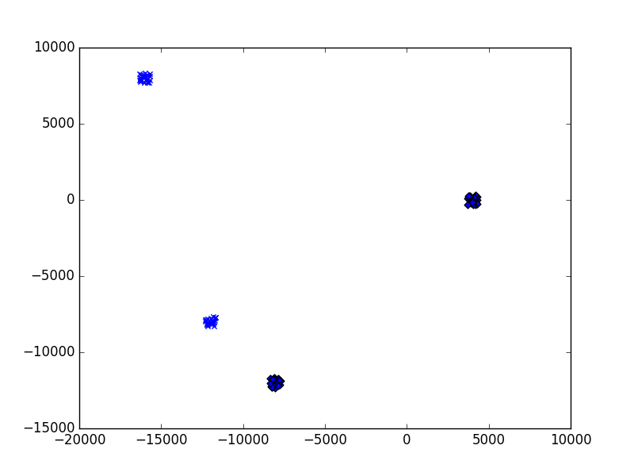
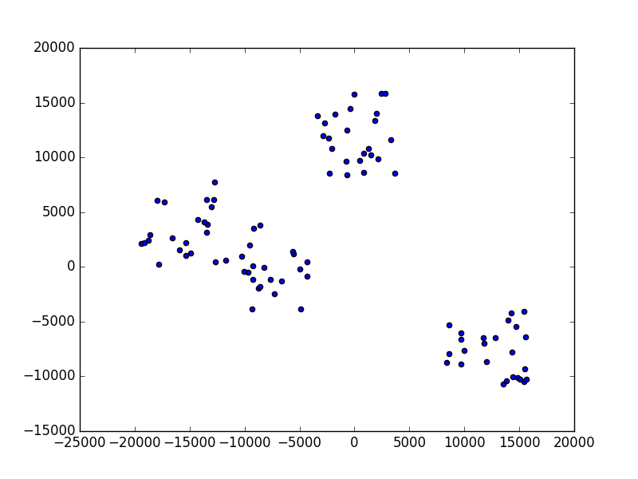

K-Means Clustering
=====================

Learning Objectives

- Understand data clustering  
  
- Learn the k-mean algorithm

- Write a test generator for creating test cases

- Implement the algorithm in Python

  
Clustering Data
---------------

Consider the following scenario: A department store is planning the
annual promotion. The store wants to give customers discount coupons
based on their purchase history.  If a customer has purchased a desk
at this store, the customer is given a coupon for a desk.  If a
customer has purchased shoes, the customer is given a coupon for
shoes.  If a customer has purchased a jacket, the customer is given a
coupon for a jacket.  The store sells thousands of products and it
does not want to give one type of coupon for each product because
doing so would create thousands of types of coupons.  It would be too
expensive making so many types of coupons and programming the checkout
machines to recognize these many types of coupons.  Instead, the store
wants to provide only a few (say 10) types of coupons.  The store
wants to group the customers based on what they bought together.  For
example

- If a customer has bought shirts, shoes, and a sweater together,  this customer is given a coupon for clothes.

- If another customer has bought a desk, a dining table, and four chairs, this customer is given a coupon for furniture.

- If a third customer has bought a tie and shoes, this customer also receives a coupon for clothes (not for furniture).

- If the fourth customer has bought chair and a desk, this customer receives a coupon for furniture (not for clothes).

The problem is that the store does not know how to group the customers
so that the same group of customers gets the same coupon.  In other
words, the store wants to divide the customers into groups so that the
customers in each group have bought similar items.  The discussion
above assumes that customers would likely buy what they have already
bought.  In reality, stores would give customers coupons for what they
may buy later.  For example, if a customer has bought a desk, the
customer is unlikely to buy another desk soon.  Instead of giving a
coupon for another desk, the store may give a coupon for buying a
chair.  If a customer has bought a jacket, the store may give a coupon
for a sweater.

Consider another example: A research project wants to find the
commonalities among lung cancer patients. They want to divide the
patients into group based on personal information and behavior, such
as age, location, occupation, education, marital status, diet, amounts
of sleep, the food they eat, etc. They want to know whether one group
has more patients than the other groups.

.. index::
   unsupervised learning
   unsupervised learning: clustering

Both examples are *clustering* problems: these problems divide
data (people in both cases) into groups so that the data inside each
group is similar and the data in different group is dissimilar.  This
is unsupervised learning because there is no teacher telling computers
whether two pieces of data belong to the same group.  The correct
answer depends on the other pieces of data.

Clustering into Groups
----------------------

.. index::
   unsupervised learning: clustering: k-mean

Consider the department store coupon problem again. Suppose the store
decides to issue exactly ten types of coupons.  The problem becomes
dividing the customers into ten groups based on their purchase
history.  This section describes the *k-mean clustering algorithm*;
here, :math:`k` is a number assigned to the problem as the number of groups.
For the department store, :math:`k` is 10.  Before explaining how this
clustering method works, let us understand what this method wants to
accomplish.  An obvious question is how to decide the value of
:math:`k`. This book will discuss that later.

Suppose there are :math:`n` data points (each point is a person): :math:`x_1`,
:math:`x_2`, ..., :math:`x_n`. Each data point is a vector.
The department store considers these products:

- refrigerator
- washer
- dryer
- jackets
- shirts
- shoes
- pants
- sweaters

For example, :math:`x_1 = <1, 0, 0, 3, 5, 0, 0, 2>` means that in the past
twelve months the first customer has bought one refrigerator, no
washer, no dryer, three jackets, five shirts, no shoes, no pants, and
two sweaters.  If :math:`x_2 = <0, 1, 1, 0, 0, 1, 0, 0>` means the second
customer has bought no refrigerator, one washer, one dryer, no
jackets, no shirts, one pair of shoes, no pants, and no sweater.

Define K-Mean Clustering Problem
--------------------------------

We want to group these :math:`n` data points into :math:`k` clusters:
:math:`C_1`, :math:`C_2`, ..., :math:`C_k`. Obviously :math:`k` must
not exceed :math:`n`. In reality, :math:`k` is usually much smaller
than :math:`n`, i.e., :math:`k << n`.  Each cluster contains a set of
data points.  In this book, a vector uses a lower case letter such as
:math:`x`. A set uses an upper case letter such as :math:`C`. The
following properties must be satisfied:

- A data point must belong to one cluster: :math:`\forall i, 1 \le i \le
  n, \exists m, 1 \le m \le k`, such that :math:`x_i \in C_m`. This means
  for any value of :math:`i` between 1 and :math:`n` (inclusively), there is a
  value :math:`m` between 1 and :math:`k` (inclusively), such that :math:`x_i` is an
  element of :math:`C_m`.

  
- Each cluster contains one or more data points, i.e.,
  :math:`|C_j| \ge 1`, for :math:`1 \le j \le k`.  In other words, an
  empty cluster cannot be accepted.
  
- The clusters together includes all data points: :math:`C_1 \cup C_2
  \cup ... \cup C_k = \{x_1, x_2, ..., x_n\}`.

- A data point must not belong to two or more clusters: :math:`\forall
  i, 1 \le i \le n` if :math:`x_i \in C_j` and :math:`x_i \in C_m` then :math:`j = m`,
  here :math:`1 \le j, m \le k`.  To put it in another way, :math:`C_j` and :math:`C_m`
  has no overlap if :math:`j \ne m`: :math:`C_j \cap C_m = \emptyset`.

  
How is the problem defined? Suppose :math:`D` (as distance) defines
how dissimilar the data points of each cluster.  If the data points
are quite similar, :math:`D` is small.  If the data points are
quite dissimilar, :math:`D` is large.  The goal is to assign :math:`x_1`,
:math:`x_2`, ..., :math:`x_n` to :math:`C_1`, :math:`C_2`, ..., :math:`C_k` so that

:math:`\min \underset{j = 1}{\overset{k}{\sum}} D(C_j)`

is as small as possible.

This is a *minimization problem*. A minimization problem aims to make
a quantity, called the *cost function*, as small as possible.
Minimization problems are *optimization problems*, so are
*maximization problems*.  A maximization problem aims to make a
quantity, called the *profit function* or *score function*, as large
as possible.

.. index::
   cost function
   profit function
   minimization problem
   maximization problem
   optimization problem

How is :math:`D` defined?  It can be defined in many ways. One commonly
used definition is the sum of pairwise Euclidean distance:

.. index::
   Euclidean distance

:math:`D(C_j) = \underset{x_r, x_s \in C_j}{\sum} (x_r - x_s)^ 2`

If :math:`x_r` and :math:`x_s` are :math:`p`-dimensional vectors:
:math:`x_r = (x_{r1}, x_{r2}, ..., x_{rp})` and
:math:`x_s = (x_{s1}, x_{s2}, ..., x_{sp})`.
The distance of them is defined as the sum of the square
of the difference in each dimension:

:math:`(x_r - x_s)^ 2 = \underset{i = 1}{\overset{p}{\sum}} (x_{ri} - x_{si})^2`.

      

It is common to divide :math:`D(C_j)` by the number of data points
in :math:`C_j` so that clusters of different sizes
are treated equally. Thus, :math:`D(C_j)` is redefined as

:math:`D(C_j) = \frac{1}{|C_j|} \underset{x_r, x_s \in C_j}{\sum} (x_r - x_s)^ 2`.

Rewrite the cost function as 

:math:`\min \underset{j = 1}{\overset{k}{\sum}}  \frac{1}{|C_j|} \underset{x_r, x_s \in C_j}{\sum} (x_r - x_s)^ 2`.

      
Number of Solutions for Clustering
----------------------------------

Deciding the proper value of :math:`k` is a difficult problem because
there are many possible solutions when :math:`n` and :math:`k` are
large. How many possible solutions are there?  This is equivalent to
the *set partition problem*: divided a set of :math:`n` elements into
:math:`k` non-overlapping non-empty subsets.  Suppose the :math:`n`
data points can be assigned to any of the :math:`k` clusters, there
are :math:`k^n` possibilities.  This, however, allows empty clusters.
Thus, we have to exclude the situation when one cluster is empty. In
this case, there are :math:`(k-1)^n` options.  If two clusters are
empty, there are :math:`(k-2)^n` options.  Continue until all except
one cluster is empty. The total number of options is

:math:`k^n - (k-1)^n - (k -2) ^ n ... - 1^n = k^n - \underset{i = 1}{\overset{k-1} \sum} (k-i)^n`.

      
K-Mean Algorithm
----------------      

When :math:`n` and :math:`k` are large, there are too many possible
solutions and finding the best solution (or one of the best solutions,
if several solutions are equally good and better than the other
solutions) would be difficult. Instead of find the best solution, a
heuristic, called the *k-mean algorithm*, usually finds good
solutions.  This is the step of the k-mean algorithm:

.. figure:: kmean/figures/kmeanalgorithm.png

   K-Mean Algorithm

A cluster's centroid is  the center of the data points assigned to this cluster.
For cluster :math:`C_j`, its centroid is 

:math:`\frac{1}{|C_j|} \underset{x_r \in C_j}{\sum} x_r`.

Please remember that each data point is a :math:`p`-dimensional vector.

This is a *heuristic solution*, meaning that the solution often works
but there is no assurance. The solution may fail in some cases.  For
many problems, finding the best solution (or solutions) can be
computationally difficult because there are too many possibilities to
check.  Instead of finding the best solution, an algorithm is adopted
to find "good enough" solutions fast.  For the *k-mean* clustering
problem, there is no easy way to determine the best value of
:math:`k`. Thus, there is not clearly defined best solution.

      
Generate Test Cases
-------------------

Before showing the implementation in Python, this section
discusses how to generate test cases.  Lacking test cases of known
properties is one common problem in developing software for machine learning.  The purpose of machine
learning is to recognize unknown patterns in data.  How can we know
that the programs are correct if we do not know what the programs
should find?
Two methods are commonly used:

- Creating simple test cases manually with known patterns.

- Adopting widely used test cases whose patterns have already been studied.

The first methods is restricted to only very small test cases that are
unlikely to have sophisticated patterns needed to test computer
programs.  The second methods, in contrast, may have sophisticated
patterns but the data may be too complex for identifying problems in
the programs.

Another approach is to write another program (or several programs) as
a "test case generators" to generate the test cases of known patterns.
More specifically, for this problem, we can write a program that
generates :math:`n` data points in :math:`k` clusters (:math:`n > k`).
Since the data points are generated intentionally, it is easy to test
whether the :math:`k`-mean program is correct.

Writing a good test case generator takes some thinking because the
generator has to consider many different possible properties. The
programs in this chapter handles integers only because floating-point
numbers have limited precision and sometimes give surprising results,
to be discussed later in this book.  This program generates two output
files: ``data.txt`` and ``cluster.txt``.  The first file has :math:`n`
lines and each line has :math:`p` integers.  The second file also has
:math:`n` lines; each line has the same :math:`p` integers, following
by one integer between :math`0` and :math:`m - 1` to indicate which
cluster this line belongs to.

.. literalinclude:: kmean/code/testmain.py
   :language: python

.. literalinclude:: kmean/code/testgen.py
   :language: python

TO DO: Need to explain the program
	      
To run the program using the default values, type ``python3 main.py``.  This is an example output ``data.txt``:

.. literalinclude:: kmean/code/data.txt

This is the corresponding ``cluster.txt``.

.. literalinclude:: kmean/code/cluster.txt

Visualize Data
--------------

Does the test case generate produce the data with expected properties?
One way to answer this question is to visualize data (up to three
dimensions).  Visualization can help inspect whether the data produced
by the test generator is indeed clustered into several regions.

.. literalinclude:: kmean/code/visualize.py
   :language: python

TODO: explain the code

     
.. figure:: kmean/figures/figure1.png

Visualize a generated test case of three clusters, clearly separated.

.. figure:: kmean/figures/figure2.png

	    A test case generated with ``-d 1 -m 4`` arguments.

.. figure:: kmean/figures/figure3.png

	    A test case generated with ``-d 3 -m 3`` arguments.	    

.. figure:: kmean/figures/figure4.png

	    A test case generated with ``-t -m 3`` arguments.	    

K-Mean Implementation
---------------------

Now is the time to show how the K-Mean algorithm can be
implemented. The implementation pretty much reflects the algorithm
described earlier.

TODO: Explain the program

.. literalinclude:: kmean/code/kmeanmain.py
   :language: python

.. literalinclude:: kmean/code/kmean.py
   :language: python

.. literalinclude:: kmean/code/datapoint.py
   :language: python

.. literalinclude:: kmean/code/centroid.py
   :language: python

Does this program work? Let's try an example.

.. figure:: kmean/figures/figure5.png

	    A generated test case.

.. figure:: kmean/figures/figure6.png   

	    The clusters are marked by different labels. The result is encouraging.

   
Next, consider some more test cases:

.. figure:: kmean/figures/figure7.png

	    A test case generated with ``-m 4`` arguments.

	    K-mean result using only two clusters.
  
The next example allows clusters to overlap by adding ``-t`` in
the test generator.

	    A test case generated with ``-t -m 4`` arguments.

.. figure:: kmean/figures/figure10.png

	    K-mean result using three clusters.
  
This looks pretty good. Running the same clutering multiple times, we may get different results:

	    
.. figure:: kmean/figures/figure11.png

.. figure:: kmean/figures/figure12.png

.. figure:: kmean/figures/figure13.png			

	    Running the program three times using four clusters.

The top one seems reasonable but the other two are questionable. Why?

	    
Understand Non-Deterministic Behavior of K-Mean
-----------------------------------------------

This is the place where most books stop and why this book is unique. This book gives deeper insight.

How can this program produces different
results even though the input data is the same?  A simple
answer is that this program is *non-deterministic* because of this line

``clu = random.randint(0, kval - 1)``

It assigns each data point to a cluster between ``0`` and ``k-1``
randomly.  It is possible that two or more data points in the same
cluster (by the test generator) are assigned to different clusters.
Python (and most programming languages) has a *random number
generator*.  It would be difficult to predict the next number after
observing a sequence of numbers.  Let us consider several
examples. This is a simply program calling Python's ``random.randint``.

.. literalinclude:: kmean/code/sequence1.py
   :language: python

The following shows the results executing the program three times.

	      
.. literalinclude:: kmean/code/sequence1.txt

.. literalinclude:: kmean/code/sequence2.txt

.. literalinclude:: kmean/code/sequence3.txt					

It is difficult to predict the next number from the numbers that have
already been seen.  Python allows programmers to set the *seed* of the
random number generator.  If the same seed is same, the same sequence
of numbers is generated.  In other words, the sequence becomes
*deterministic*.  The following program always generates the same
sequence of numbers.

.. literalinclude:: kmean/code/sequence2.py
   :language: python

The words "random" and "non-deterministic" are often confused.  Random
means it is difficult to predict in advance.  Non-deterministic means
that if the same program runs again with the same inputs, the results
may be different.  It is possible to have a deterministic sequence of
random numbers, like the ones generated by ``sequence2.py``.  The
sequence is deterministic because running the program again generates
the same sequence. The sequence is random because knowing the
generated numbers cannot predict the future numbers.

Another common confusion is "random" and "unknown".  If a sequence of
number is random, the next unseen number is unknown (unless the seed
is set).  However, something that is unknown may not be random.  For
example, you may not know the birthday of a person but this person's
birthday is not "random".

A common way of varying the seed is using the microsecond of the
current time in the following way:

``random.seed(datetime.datetime.now().microsecond)``

Be careful using time as random number seeds for keys in security
programs.  Using microseconds restrict the possible keys to only ``0``
and ``999999``, not the full scale of all possible integers.

It is possible that the data points that should be in the cluster are
put into different clusters. When this occurs, the results are not
very useful.  Since the *k-mean* algorithm does not guarantee finding
the best clustering solution, it is advised running the program
multiple times and find the result that has the smallest value of the
cost function.

Determine ``k``'s Value
-----------------------

One important question is to determine the value of ``k``.  This can
also be answered by using different values and choose one that
minimize the cost function.  The following function considers
different values of ``k`` and runs the program multiple times for each
value.

Consider the data generated using ``-d 6 -c 10 -m 50 -M 60`` as the
input.  The following figure shows the sum of the distances to the
centrolds for different values of ``k``.  It is clear that when ``k``
is too small (below 8), the distances are much larger.

.. figure:: kmean/figures/iteratedistance.png   

	    Distances for different values of ``k``.  Five times for each value.

.. figure:: kmean/figures/iteratemindistance.png   

	    Smallest distance for each value. Please notice that the smallest distance occurs when ``k`` is 13. The data is generated for 10 clusters.

   
Each value runs five times and has five bars. The size of each cluster
is shown as the height. Since the clusters together contain all data
points, the sum of the cluters' sizes is always the same.   The
sizes of the clusters can vary significantly.  For example, when ``k``
is 5, the smallest cluster has no data point and the largest cluster
has more than one third of the data points.
	    

.. figure:: kmean/figures/clustersizes.png   

	    Sizes of clusters for different values of ``k``.

	    
Clean Data before Clustering
----------------------------

The k-mean algorithm seems relatively simple. Is it actually useful?
Yes. The beginning of this chapter describes several scenarios where
clustering would be helpful.  Here are some other applications.
Imagine that you own several pizza stores and want to open new stores.
You want to decide the new stores' locations.  You have the budget to
open at most five more stores (in this case ``k`` is between 1 to 5).
You want to use the addresses of deliveries to determine the stores'
locations as the centroids of the clusters based on customers'
addresses.  This can be applied to many other scenarios: As another
example, a bank wants to decide where to install four ATM (automatic
teller machine) machines (``k`` is 4 in this case) based on customers'
home and office addresses.  Both of them can take advantage of the
clustering method.

It is common that the data needs to be "cleaned" before sending to a
clustering program.  For example, if you want to decide the locations
of pizza stores, you may want to exclude the customers that are too
far away from the other customers, maybe more than 10 km away from all
the other customers.  Maybe you also want to consider how often
customers order deliveries and give frequent customers larger weights
so that the stores are closer to these customers.  The same thinking
can be applied to selecting ATM locations: maybe you want to give
higher weights to the customers that have high account balances or use
ATM more often.

Such "data cleaning" usually requires human judgement. In the example
of deciding pizza stores' locations, should the customers be excluded
if they are more than 10km away from all the other customers?  Why
should it be 10km? Why not 5, or 8, or 15km?  If you want to include
the customers that order deliveries often even though they live more
than 10km away, how do you define "often"?  Is more than once per week
considered often? Or more than twice per week?  Is one week too short?
Instead, you prefer to consider ordering more than five times per
month?  Doing meaningful data cleaning often requires knowledge about
the business. You need to know how much it costs to deliver pizza for
customers living at different distances from the store. You also need
to know the traffic conditions: delivering pizza to a customer living
in the center of a city may take longer even though the distance is
shorter.  The business knowledge is essential understanding what data
is needed, what data should be excluded, and how to interpret the
results from the clustering method.  Using the k-mean method, or any
machine learning method, is not as simple as throwing data into a
program and get meaningful results effortlessly.

Summary
-------

K-Mean is a simple clustering method and it can be the starting point
of more complex methods. It can handle high-dimensional data (even
though visualization above three-dimensional is difficult). When you
get a set of data, you may use K-Mean (experiment with different
values of ``k``) to obtain some idea whether the data is somewhat
clustered.

